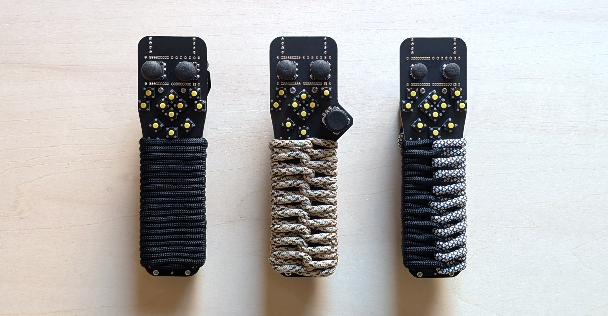

##  PeghammerPCB&ファームウェア

PCB発注用のガーバーデータは PCB → Gerberdata

3Dプリント部品発注用のデータは PCB → knob(stl) 

設計用のkicadデータは PCB → kicad 

各種ファームウェアは　firmware

■データの使用についてはライセンスの範囲内&自己責任でお願いします｡

# Peghammer

Peghammer is a stick-style left-hand input device (keyboard).

This repository contains the open-source hardware design and firmware
implementations for the Peghammer project.

## Repository Structure

This repository is organized into multiple components, each with its own
license:

- **pcb/**  
  Hardware design files (schematics, PCB layouts, Gerber data)  
  Licensed under **CERN Open Hardware Licence v2 – Permissive (CERN-OHL-P-2.0)**

- **firmware/vial/**  
  Wired firmware based on Vial (RP2040)  
  Licensed under **GNU General Public License v2.0 (GPL-2.0)**

- **firmware/zmk/**  
  Bluetooth firmware configuration based on ZMK  
  Licensed under the **MIT License**

Each license applies **only** to its respective directory unless stated
otherwise.

## Licensing Overview

This project uses multiple open-source licenses:

- Hardware (PCB): CERN-OHL-P-2.0  
- Firmware (Vial): GPL-2.0  
- Firmware (ZMK): MIT  

Please refer to the `LICENSE` file in each directory for full license terms.

## Distribution and Sales Notes

- The hardware design may be manufactured and sold under the terms of
  CERN-OHL-P-2.0.
- If Vial firmware binaries (HEX / UF2) are distributed, the corresponding
  source code must be made available in accordance with GPL-2.0.
- ZMK firmware configurations are provided under the MIT License and may be
  used independently.

## Disclaimer

This project is provided “as is”, without any warranty.
The author is not responsible for any damage, loss, or issues arising from
the manufacture or use of this design.

## Author

- **nishiiba**
