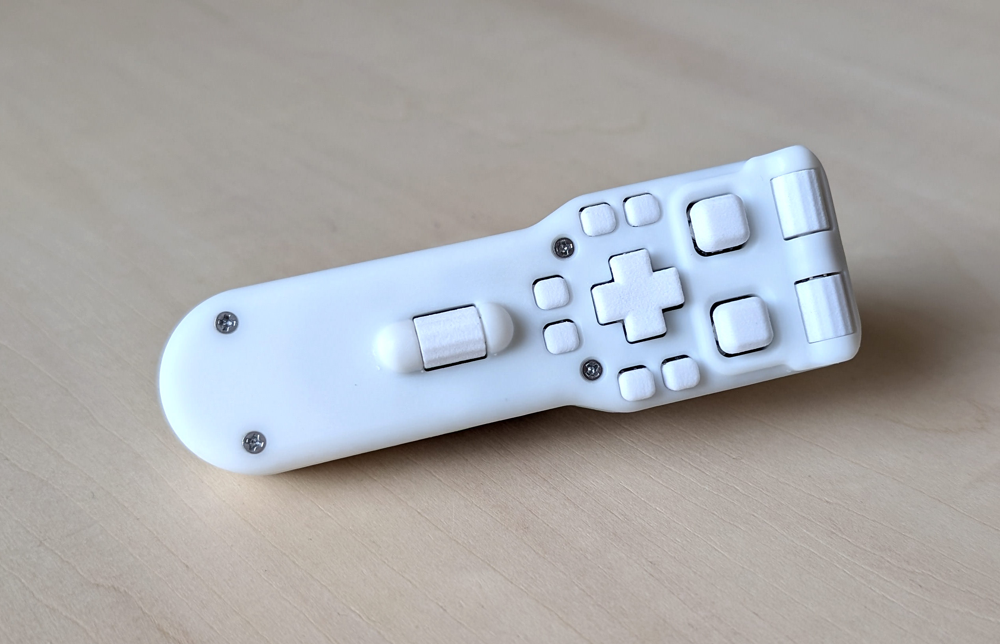
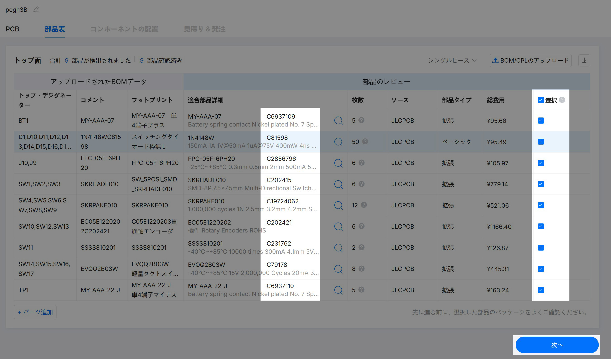
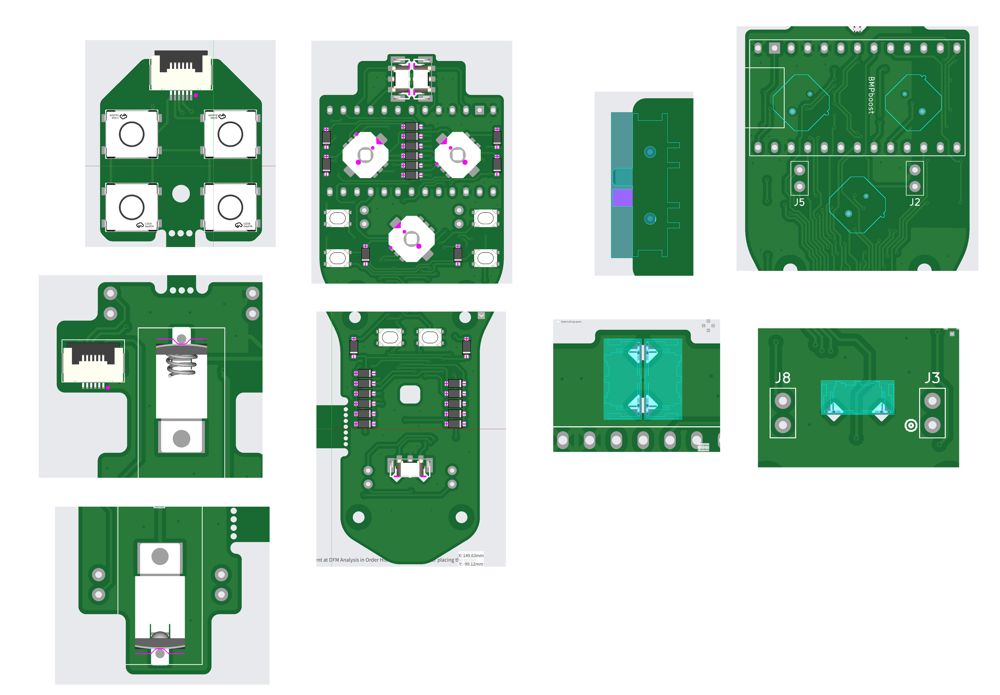
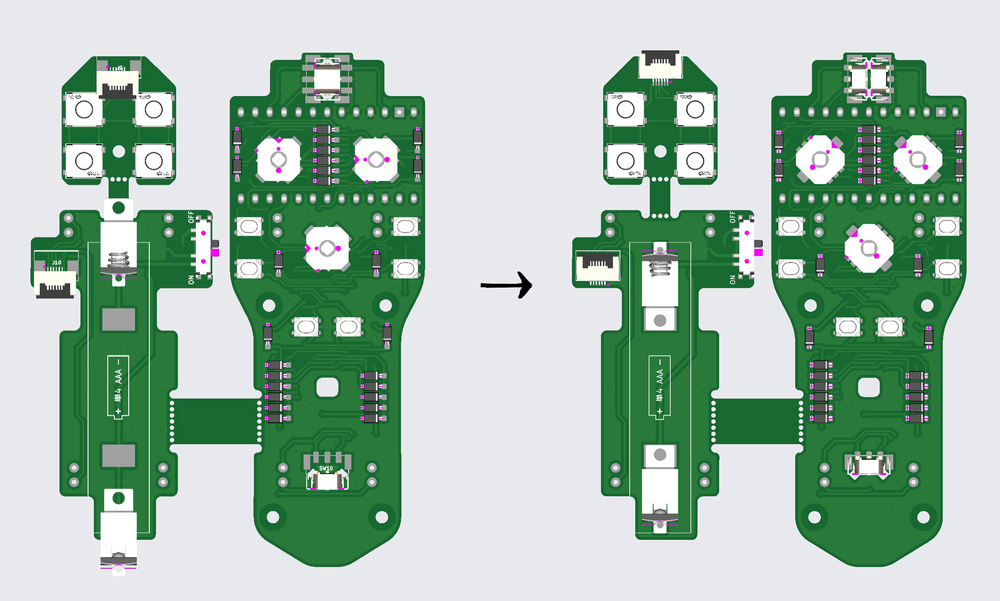
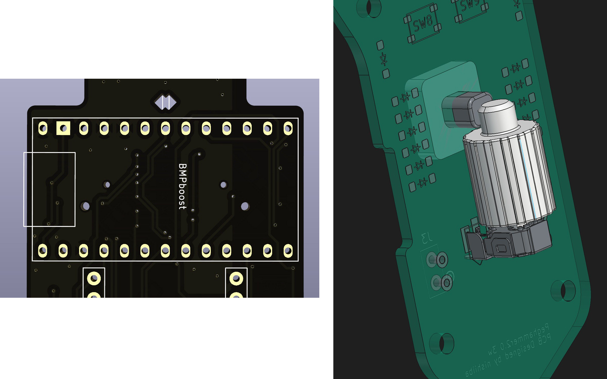

# 3ホイール版

発注組立設定はほぼ同じなので補足のみです  
作製する場合は1ホイール版ビルドガイドと合わせて読み進めて下さい

  

特徴
-

 

[3Dで全体を確認](ph3w.stl)

 

25ボタン + 3ホイール(プッシュなし)  
ホイールはボタンとの組合せで最大15ホイール分のツール割り当てが可能  
作成費用は+1000円くらいです  

  

基板と3Dプリント部品の発注
-
 

**[ここからPCB.zipと3DP_3w.zipをダウンロード](https://github.com/nishiiba/peghammer/tree/main/PCB_3DP)**  
データの使用はREADMEを読んで自己責任でお願いします

 

1ホイール版から3ホイール版に作り変えたい場合  
トリガー基板と電池基板は共通なのでメイン基板だけ発注して下さい  
**[交換用の基板を単体で発注する](ts.md#交換用の基板を単体で発注したい)**  

 

基板の発注
-

 

PCB.zipの3wheelフォルダの中にあるファイルを使用します  

 

取付部品のリストに間違いはないか確認して下さい  

 

部品の位置と角度はこのように調整して下さい

 

 

ダイオード※の縦置きは+が上側､横置きは+が左側に来るようにして下さい  
ctrlキーを押しながら選択するとまとめて移動させることができます

 

※黒い長方形のチップ部品

  

3Dプリント部品の発注
-

 

3DP_3w.zipの中にあるファイルを使用します  
LサイズとLサイズショートトリガーの2種類から選んで下さい

  

組立方法
-

マイコンは使用するピンが少ないのでコンスルーのピン差し替えは不要です  
ここに差し込めるよう短くカットして下さい  

中央のエンコーダはホイールを差し込んだら基板の裏から固定ピンを差し込んで下さい

 

 

他は1ホイール版とほぼ同じです

 

ファームウェア設定
-

 

**[ここからファームウェアをダウンロード](https://github.com/nishiiba/zmkconf_pegh3w_p)**  
keymap-editorを使用する場合はこのリポジトリをフォークして下さい

  

#### [戻る](Index.md#目次)

 
 

---

このビルドガイド（文章・画像）は [CC BY 4.0](https://creativecommons.org/licenses/by/4.0/deed.ja) の下に提供されています。

Copyright (c) 2026 nishiiba
