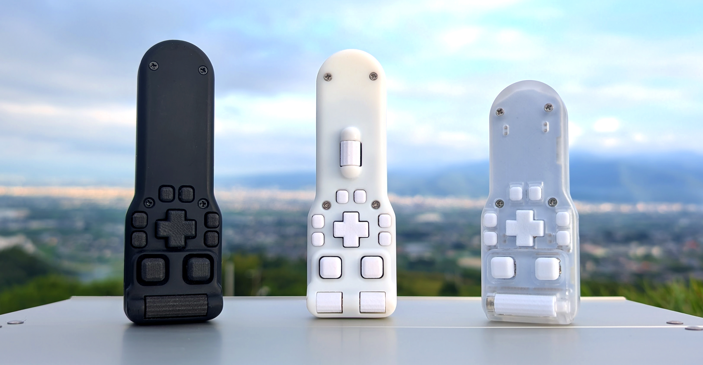
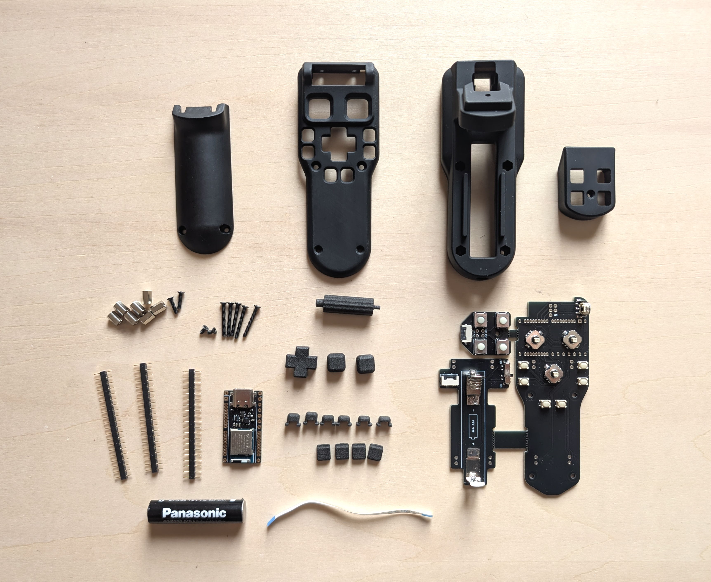
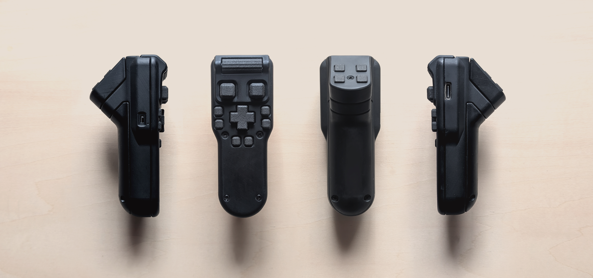
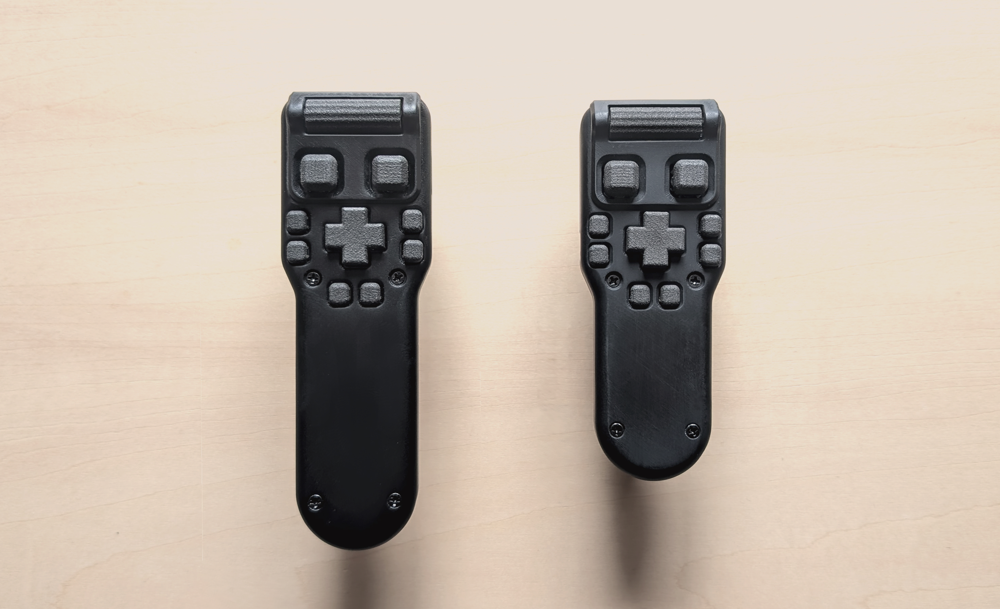

## 【漫画/イラスト用】無線左手デバイス Peghammer ビルドガイド

 

 

**Peghammerは自分で組み立てる自作左手デバイスです**

はんだ付け不要でそこそこ簡単組み立て    
作製費用は約2.3万円です  

 
 

 

※キット販売ではありません  
公開している基板と3Dプリント部品のデータを使い  
発注から組み立て､設定までの手順を解説しています  

 

## 特徴

 

[3Dで全体を確認](ph.stl)

 

24ボタン + ホイール(プッシュなし)  
対応OS　Windows/macOS/iPadOS/android  
Bluetooth接続  
ZMKファームウェア  
常駐アプリなし  
単4電池1本で数ヶ月間動作  
右利き左利き両用  

 

 

**サイズ**  
長さ　Lサイズ 114mm　Sサイズ 97mm  
幅　37mm  
厚さ　49mm  
グリップ部分の直径　30mm

**重さ(電池含む)**  
Lサイズ　92g  
Sサイズ　85g

 

･ボタンはタップ､ダブルタップ､長押し､同時押し､マクロなどの機能を設定可能です

･ホイールはボタンとの組合せで最大5ホイール分のツール割り当てが可能です

･ショートカットキーが変更できないProcreateなどでも使用可能です  

･初期設定とボタン設定変更にはwidowsかmacのPCが必要です   

･電池寿命は計測中で原稿作業に使用して4ヶ月目です(エネループプロ)

 
 
  

商用利用OKです  
完成品を販売する場合はライセンスを守って自己責任でお願いします  

撮影後に基板とケースに修正を加えたので写真と実物は少し形状が違います  

 

 

## 目次

 

デバイスについて  
-
### [スイッチの操作感と静音化](sw.md)  
### [3ホイール版](3w.md)  

 

発注
-
### [基板の発注](order_1.md)  
### [3Dプリント部品の発注](order_2.md)  
### [その他必要部品と費用について](order_3.md)  

 

組み立てと設定
-
### [組み立て](build_PCBA.md)  
### [ファームウェアの書き込みとペアリング](setting_1.md)  
### [DYA Studioを使用したボタン設定](setting_2.md)  
### [keymap-editorを使用したボタン設定](setting_3.md)  

 

その他
-
### [トラブルシューティング](ts.md)  
### [【お苦しみ】手作業ではんだ付け](build_manual.md)  

  

---

このビルドガイド（文章・画像）は [CC BY 4.0](https://creativecommons.org/licenses/by/4.0/deed.ja) の下に提供されています。

Copyright (c) 2026 nishiiba
