# 組み立て

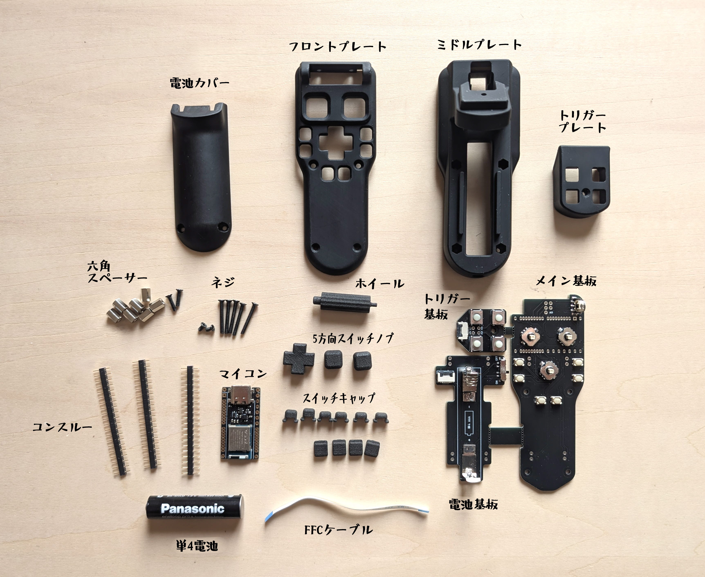

## 注意

･マイコンは静電気に弱いので作業前に体から静電気を逃がして下さい  

･3Dプリント部品がはまりづらい場合は紙やすりで軽く削って下さい

･コンスルーは約50回､FFCコネクタには約20回の抜き挿し上限回数があり  
頻繁な分解は接触不良の原因になります

**･電池は絶対逆向きに入れないで下さい**  
**無理にはめこんで通電してしまうとマイコンが壊れます**

 
 

## 必要工具

**■100均**  
模型用ニッパー  
プラスドライバー　1番（PH1）  
ラジオペンチ  
デザインナイフか小さめのカッターナイフ  
耐水紙やすり#600　1枚  
ピンセット  
リップクリーム  
養生テープ

 

**■秋月電子**  
ジョイスティック(5ポジションスイッチ)DIP化キット

 
 

## 組み立て手順

①レジン部品(ケース)の洗浄
-

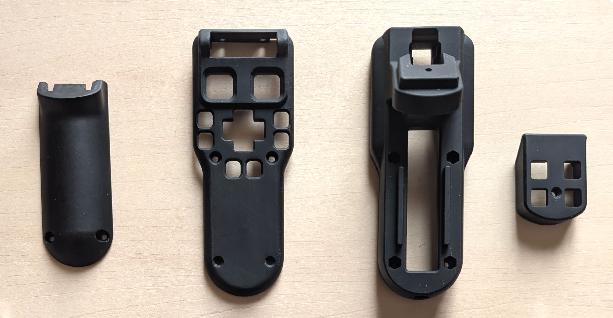

 

レジン部品はオイルコーティングされた状態で届くので中性洗剤でよく洗って乾かします  
積層痕が気になる場合は濡らした紙やすりで磨いて下さい

 

②ナイロン部品(キャップ)の切り離し
-

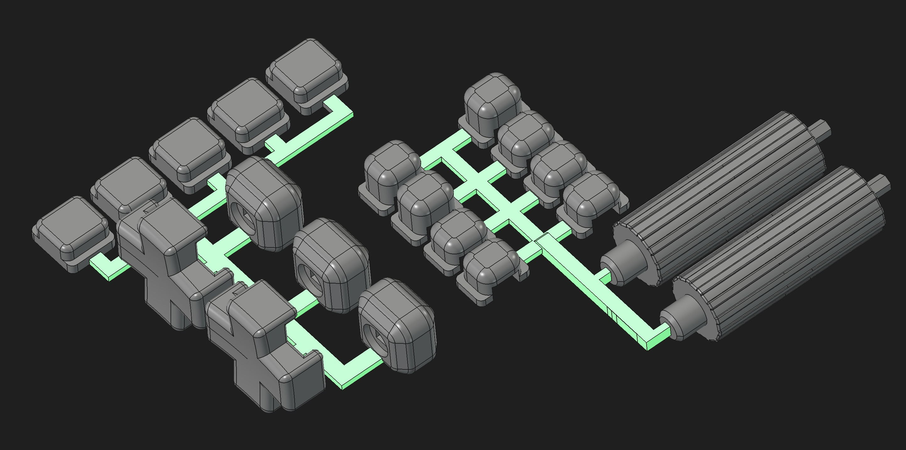

 

ニッパーを使ってキャップ類をランナー(緑色の部分)から切り離します  
切り離した部分が段差になっているとスイッチの動きが悪くなるのでナイフで根本までカットして下さい

 

③基板の切り離し
-

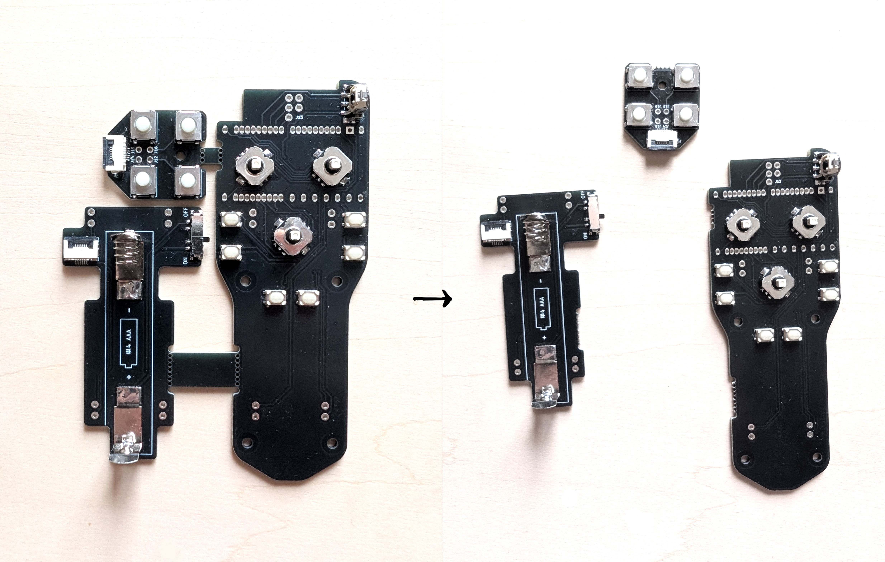

 

基板を点線の部分で折り曲げて3つに分割します  
ラジオペンチを使う場合は捨て板になる部分を掴んで折るようにして下さい

 

④プラス端子に養生テープの貼り付け
-

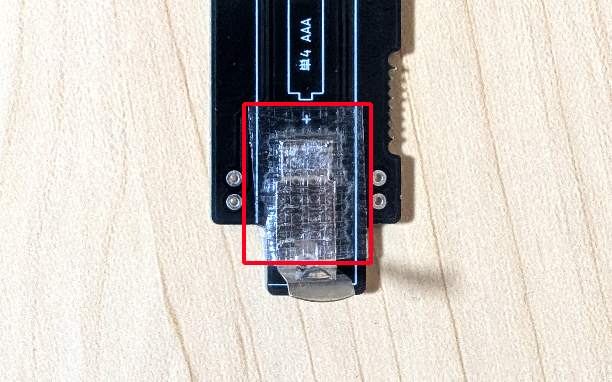

 

養生テープをカットしてプラス端子の土台を覆うように貼り付けて下さい  
電池を逆入れしてしまった時に端子が接触しないようにする保険です

 

⑤5方向スイッチノブの取り付け
-

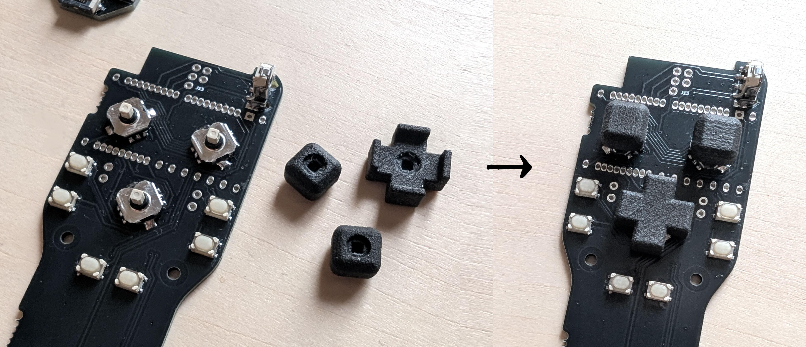

 

ノブは穴にリップクリームを薄く塗って上からまっすぐ差し込みます  
力をかけすぎるとスイッチが壊れてしまうので気をつけて下さい 

 

差し込みがきつい場合はジョイスティックDIP化キットのピンに何度か抜き差しして  
少しゆるくしてから本体の5方向スイッチに取り付けるようにして下さい

 

逆にゆるすぎて抜けてしまう場合の修正方法は[トラブルシューティング](ts.md#5方向スイッチのノブがゆるくて抜けてしまう)にまとめてあります

 

⑥コンスルーのピン差し替え
-

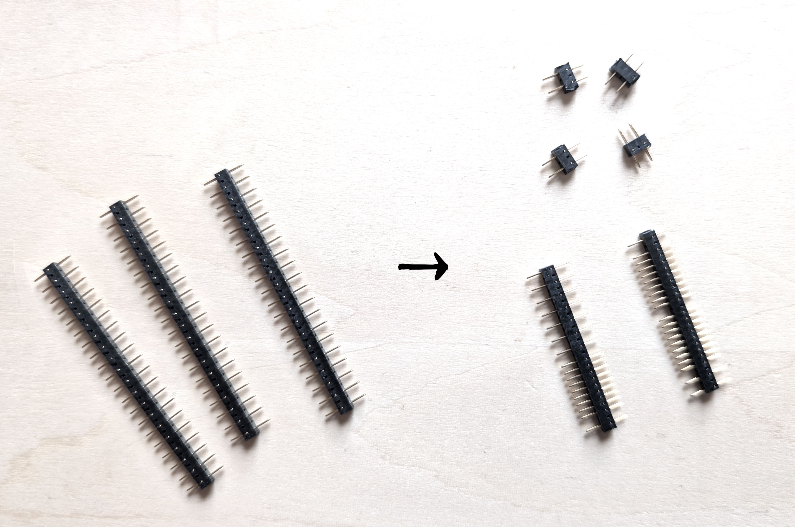

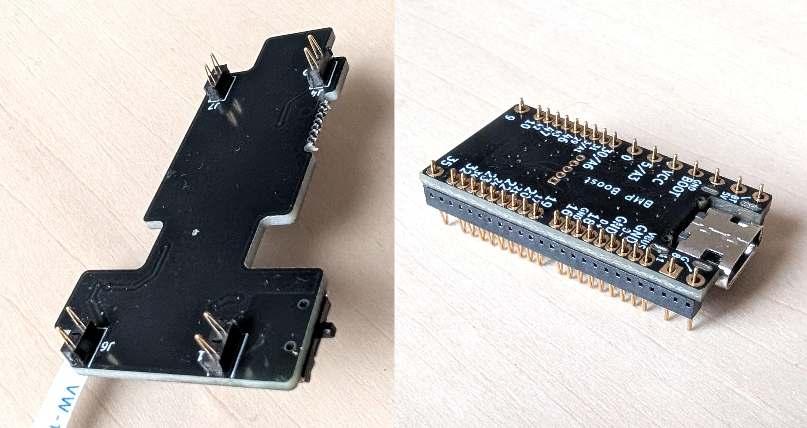

 

コンスルーのピンを差し替えて基板接続用ピン(4個)とマイコン接続用ピン(2個)を作ります

 

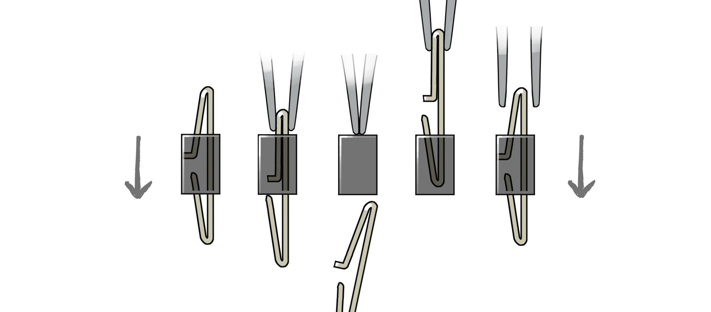

 

ピンは図のようにピンセットを使って差し替えて下さい  
差し替え終わったら余った樹脂部分をニッパーで短くカットします  

※ピンは押し出した時に飛びやすいので注意して下さい

 

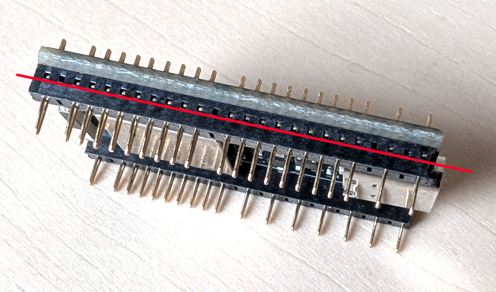

 

**補足 : コンスルーの向きについて**  
コンスルーには向きがあり挿す方向によってバネの力のかかり方が違います

｢側面の穴は上寄りにして外側に向ける｣といった感じで  
左右のコンスルーの向きを揃えられるようにピンを差し替えて下さい

 

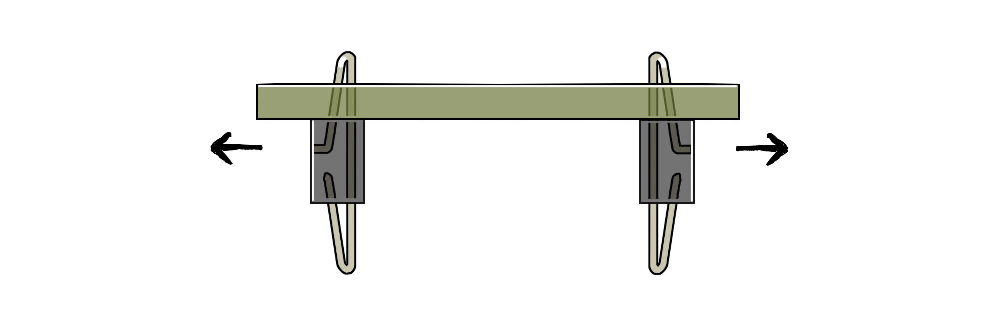

 

 

⑦ストラップの取り付け
-

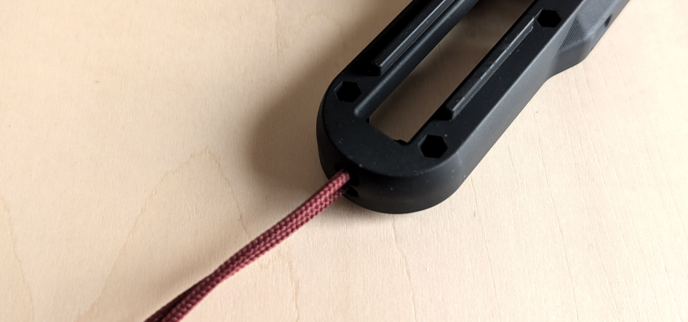

 

ストラップが必要な場合はここでミドルプレートに取り付けて下さい  
紐は2mmの太さまで使用可能です  

 

⑧FFCケーブルの取り付け
-

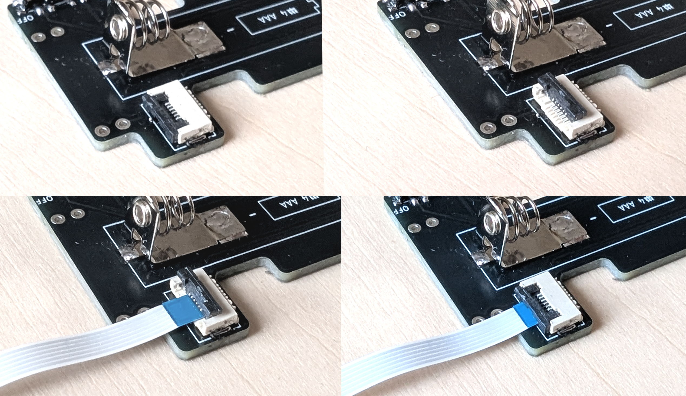

 

電池基板にFFCケーブルを取付けます  
黒い部分を引き上げてケーブルをまっすぐ差し込みロックします

 

⑨メイン基板と電池基板の接続
-

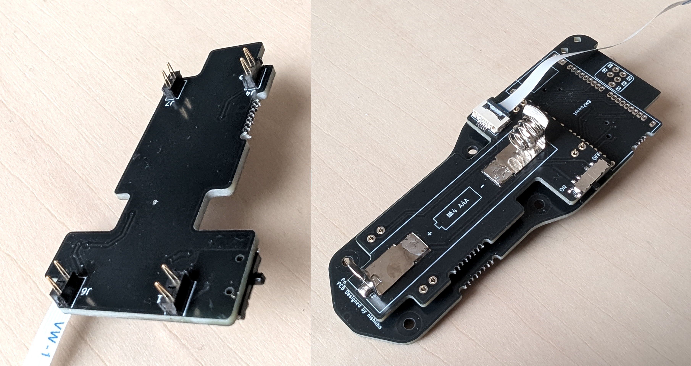

 

電池基板に4箇所の接続用ピンを取り付けてメイン基板と接続します

 

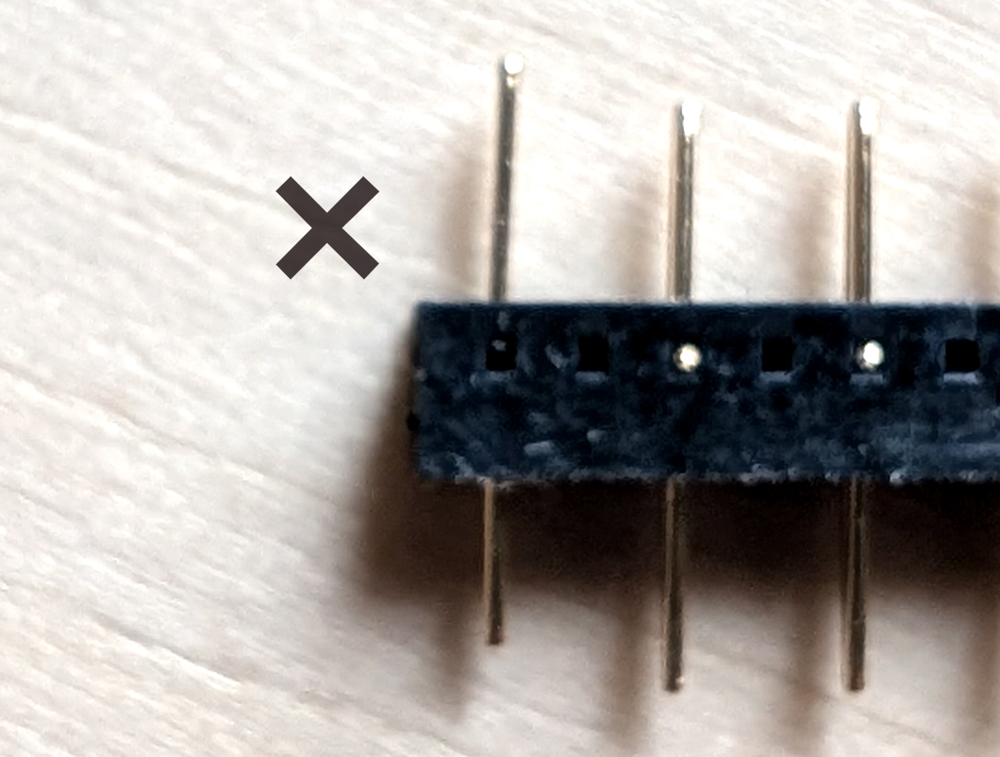

**コンスルーのピンは抜けかけた状態で差し込むと接触不良の原因になるので気をつけて下さい**

 
 

⑩マイコンの取り付け
-

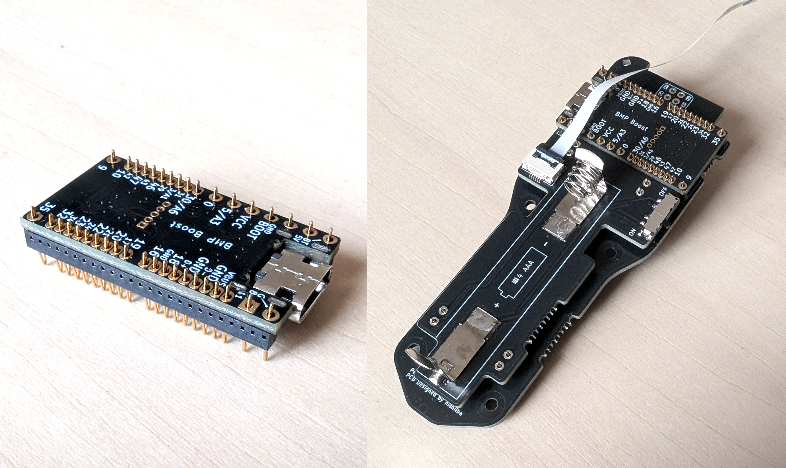

 

マイコンにコンスルーを取り付けてメイン基板と接続します

 

コンスルーを取り外す場合は引っ張るのではなく  
基板から突き出たピンの先を押し出すように外します

 

⑪ホイールの取り付け
-

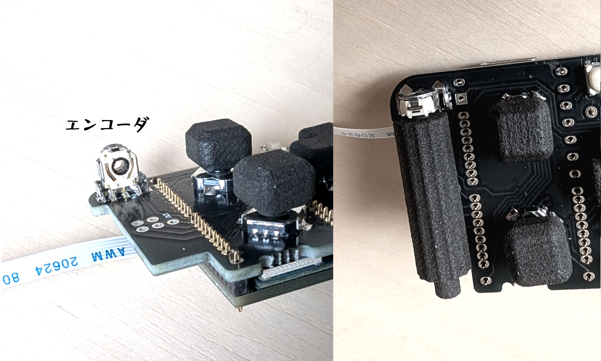

 

ホイールのシャフトにリップクリームを薄く塗ってからエンコーダの穴に差し込みます

エンコーダは小さく壊れやすい部品です､差し込みはエンコーダを押さえながら慎重に行って下さい

 

⑫基板をミドルプレートに取り付け
-

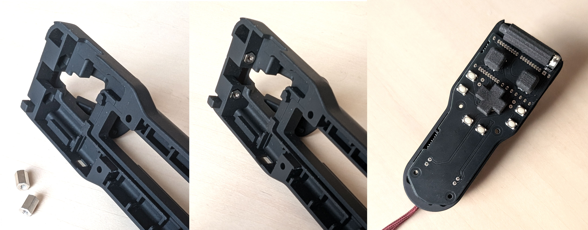

 

ミドルプレート上部に六角スペーサーをはめこんでから基板を取り付けます  
左側のスライドスイッチが引っかからないようにずらしてはめ込んで下さい  

上手くはまらない場合は電池基板だけ先にミドルプレートに取り付けてから  
メイン基板をはめ込みます

**FFCケーブルの先はトリガープレートの取付け穴から出して**  
**中で挟まらないように気をつけて下さい**

 

⑬フロントプレートにスイッチキャップの取り付け
-

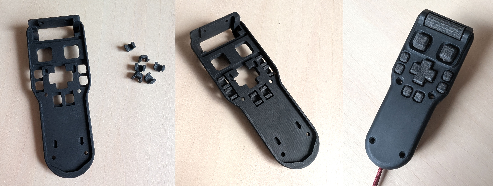
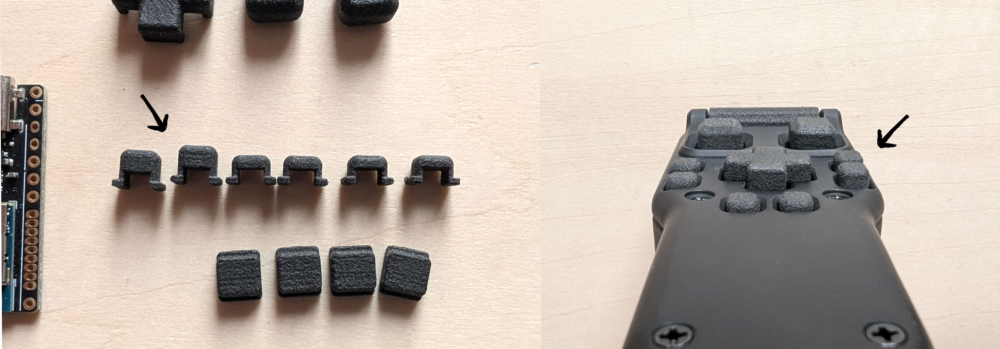

 

フロントプレートにスイッチキャップを取り付け  
ミドルプレートと組み合わせます

**左手デバイスにする場合､2個の長いキャップは右側に**  
**右手デバイスにする場合は左側に取り付けて下さい**

余ったキャップは予備です

 

⑭ミドルプレートとフロントプレートのネジ止め
-

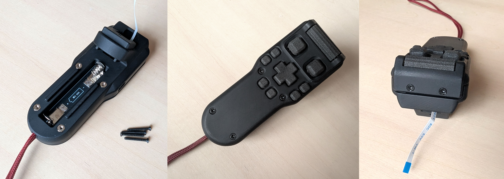

 

裏返して4箇所に六角スペーサーをはめ込み  
表側4箇所に16mmネジ､上部2箇所に8mmネジで仮締めをして下さい

 

⑮電池カバーの取り付け
-

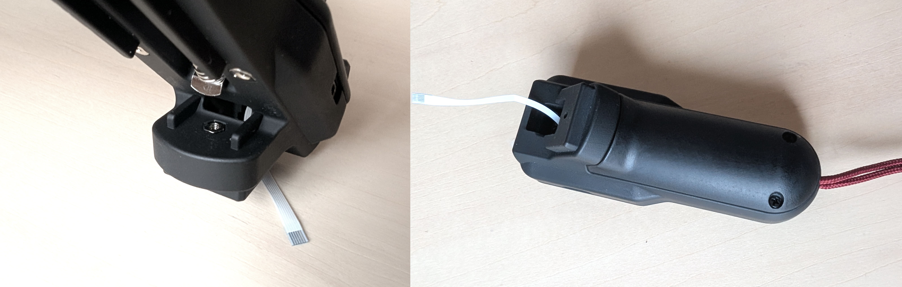

 

裏返してトリガープレート用の六角スペーサーを取り付け  
電池カバーを被せて4mmネジで仮締めして下さい

ショートトリガー版の場合は4mmの六角スペーサーを使用します

 

**電池はまだ入れないで下さい**

 

⑯トリガー基板とトリガープレートの取り付け
-

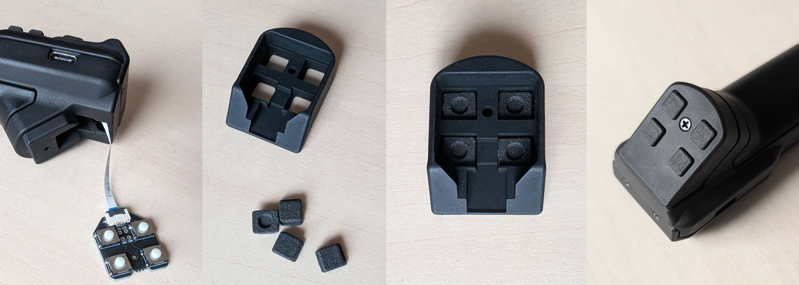

 

トリガー基板にFFCケーブルを繋いで  
上からスイッチキャップをはめこんだトリガープレートをかぶせ  
16mmネジで仮締めします

ショートトリガー版の場合10mmネジで仮締めします  

 

⑰ネジの本締めと調整  
-

全てのネジを本締めします  
各ボタンを操作してスムーズに動かない場合はネジを緩め  
プレートを少しずらしてから締め直して下さい  

**レジンは割れやすいのでネジの締めすぎに注意して下さい**

5方向スイッチノブは個体差で差し込み穴が傾いていることがあります  
操作に支障が出るほど傾いている場合は取り付け向きを変えて下さい

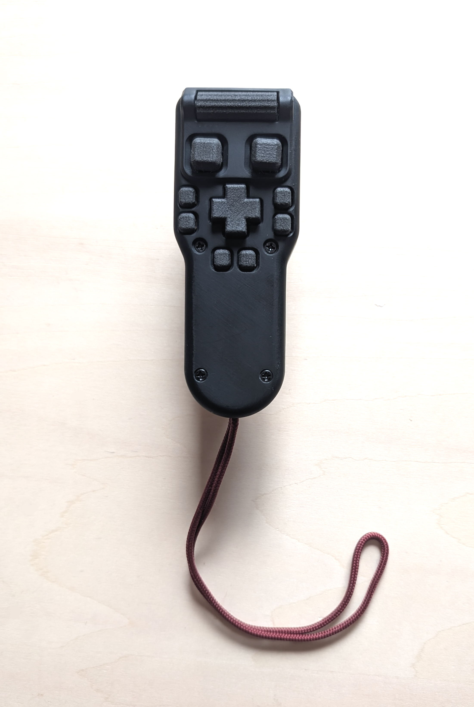

 

 

問題なければ電池を入れて組み立て完了  
左側面のスイッチをマークのある位置にスライドさせると電源が入ります

 

#### [戻る](Index.md#目次)

 
 

---

このビルドガイド（文章・画像）は [CC BY 4.0](https://creativecommons.org/licenses/by/4.0/deed.ja) の下に提供されています。

Copyright (c) 2026 nishiiba

