# 基板(PCB)の発注

 

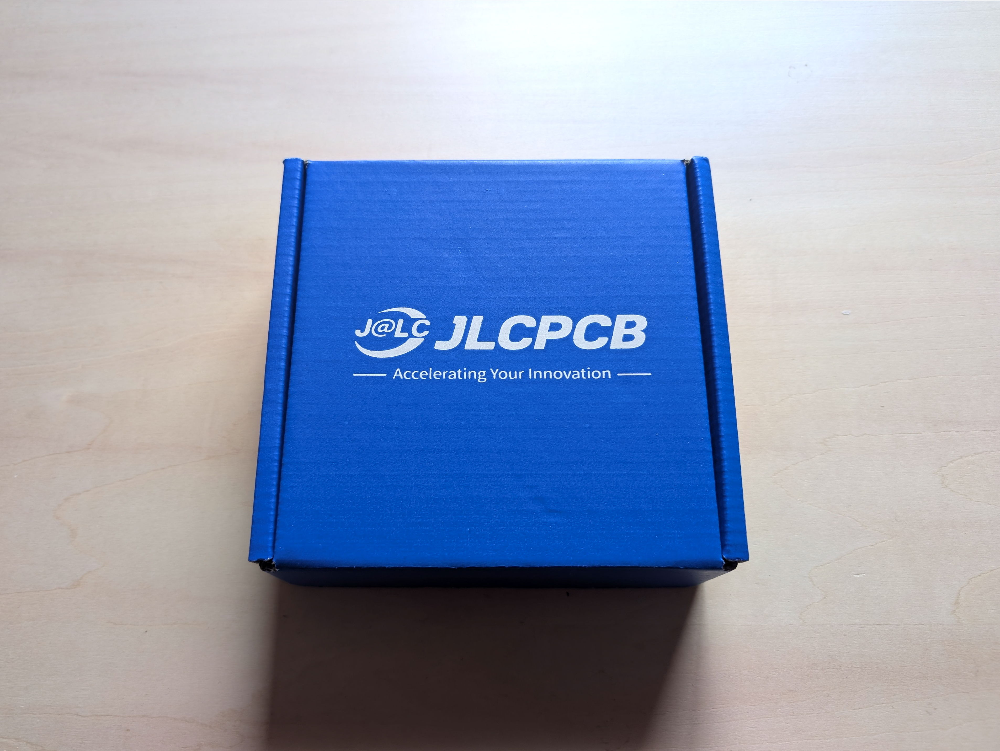

 

基板の発注は自作キーボード設計でよく利用されるJLCPCBで行います  
少し手間がかかりますが順を追っていけば難しくはないのでがんばって下さい  

 

①発注用データのダウンロード
-

 

**[ここからzipファイルをダウンロード ](https://github.com/nishiiba/peghammer/tree/main/PCB_3DP)**  
データの使用はREADMEを読んで自己責任でお願いします  

 

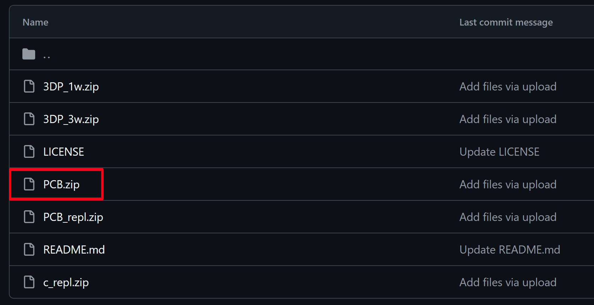

 

 

②JLCPCBアカウントの作成
-
 

アカウント作成手順については分かりやすいサイトがいくつもあるので省略します  
｢JLCPCB アカウント作成｣で検索して下さい

 

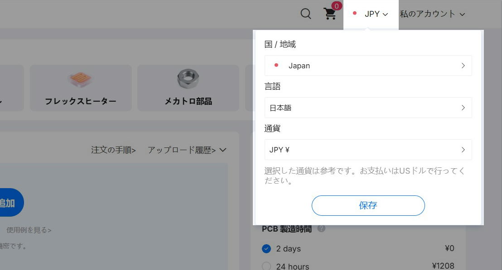

 

アカウントを作成したら右上の設定から  
国をJapan､言語を日本語､通貨をJPYに変更して下さい

海外サイトなので支払い方法はペイパルがおすすめです

 

③基板データのアップロード
-

 

 

右上の発注ボタンから発注ページに入り  

 

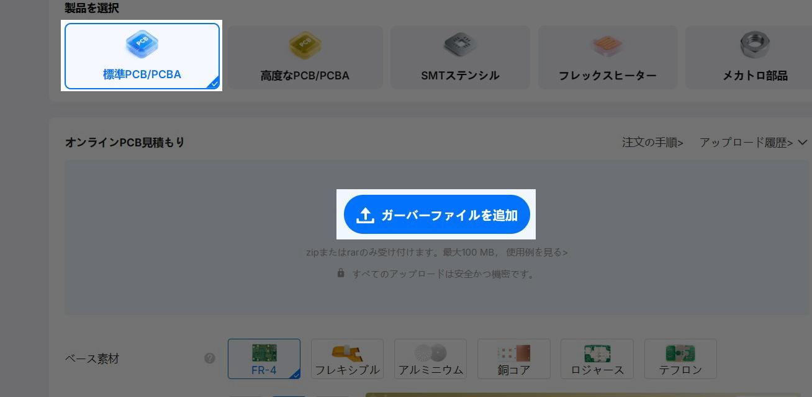

 

PCB発注ページに切り替えて｢ガーバーファイルを追加｣をクリック   

 

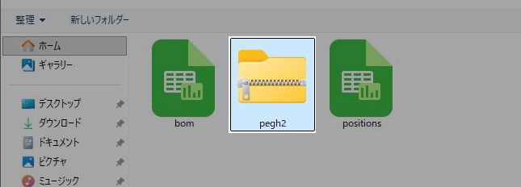

 

1wheelフォルダのpegh2.zipをアップロードします

 

④発注設定
-

 

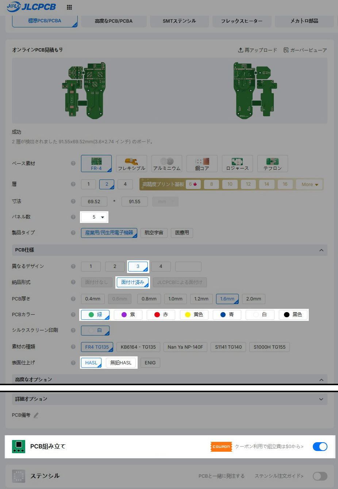

 

変更するのはこの部分です

 

･最低発注枚数は5枚です

･3種類の基板を1枚にまとめているので｢3｣｢面付け済み｣を選択して下さい

･PCBカラーは好きな色を選んで下さい

･HASLと無鉛HASLは使用上差はありません､廃棄する場合は無鉛HASLの方が環境に優しいです

**無鉛HASLと特定のPCBカラーを組み合わせると価格が高くなります**

･PCB組み立てにチェックを入れて下さい

 

⑤PCBA設定
-

 

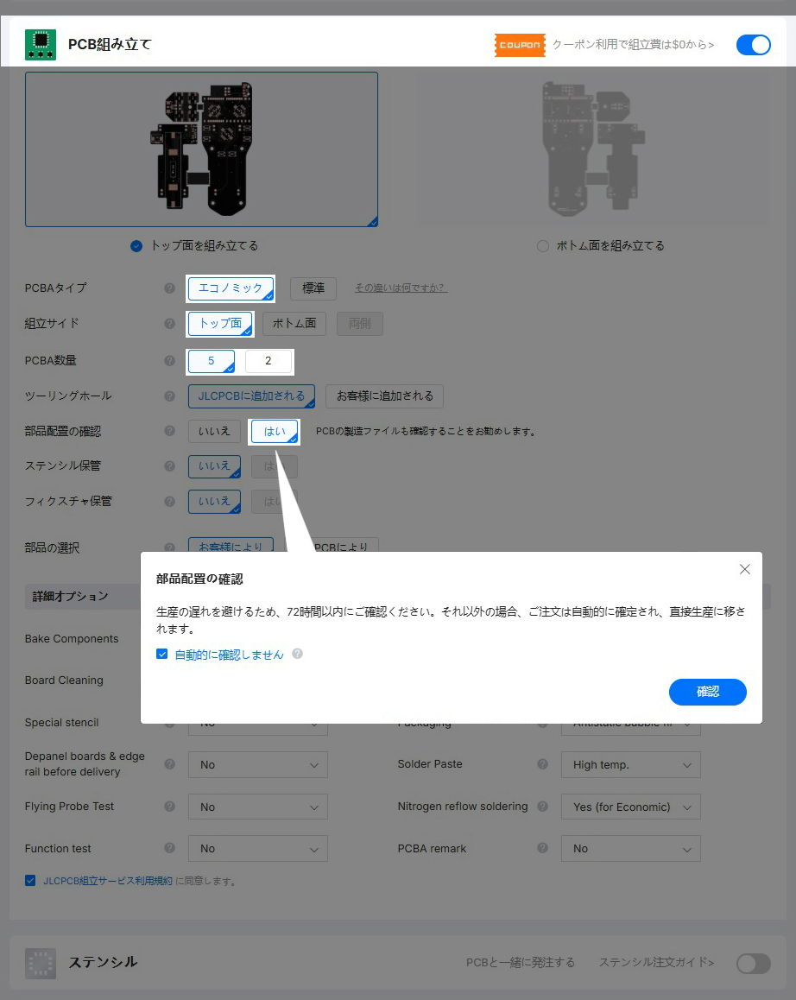

 

PCBA = 部品取付け済み基板

このように選択して下さい  

･表側にのみ部品を取り付ける安価なプランです

･生産する基板のうち何枚に部品取り付けを行うかの選択で最低発注枚数は2枚です

･部品配置の確認はJLCPCBのスタッフが配置確認してくれるオプションです

 

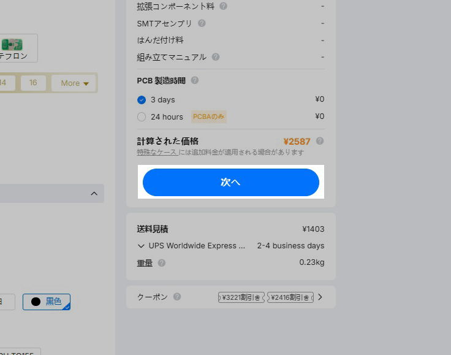

 

 

⑥BOMとCPLのアップロード
-

 

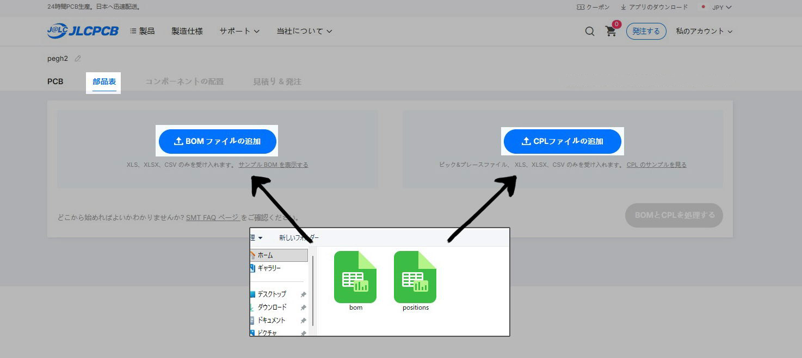

 

左上の部品表をクリック  
｢BOMファイルの追加｣をクリックしてbom.csvを､  
｢CPLファイルの追加｣をクリックしてpositions.csvをアップロードします

BOM = 取付け部品リスト  
CPL = 取付け部品の位置情報

 

⑦部品リストの確認
-
 

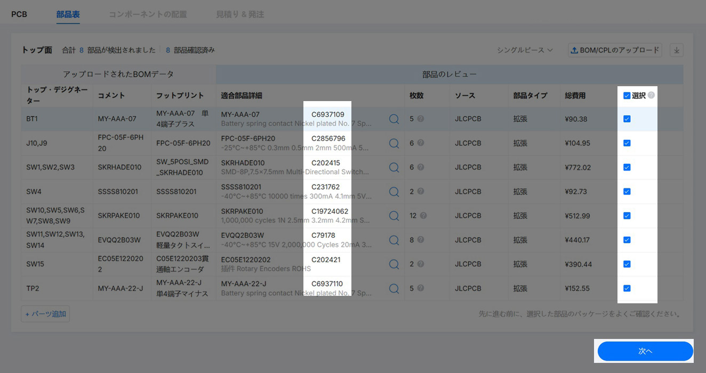

 

部品の品番が合っているかと  
チェックが入っているかを確認して次に進みます

 

※部品が欠品している場合は[こちら](repl.md)を読んで下さい

 

⑧部品位置の調整
-
 

プレビューで部品の取り付け位置調整を行います

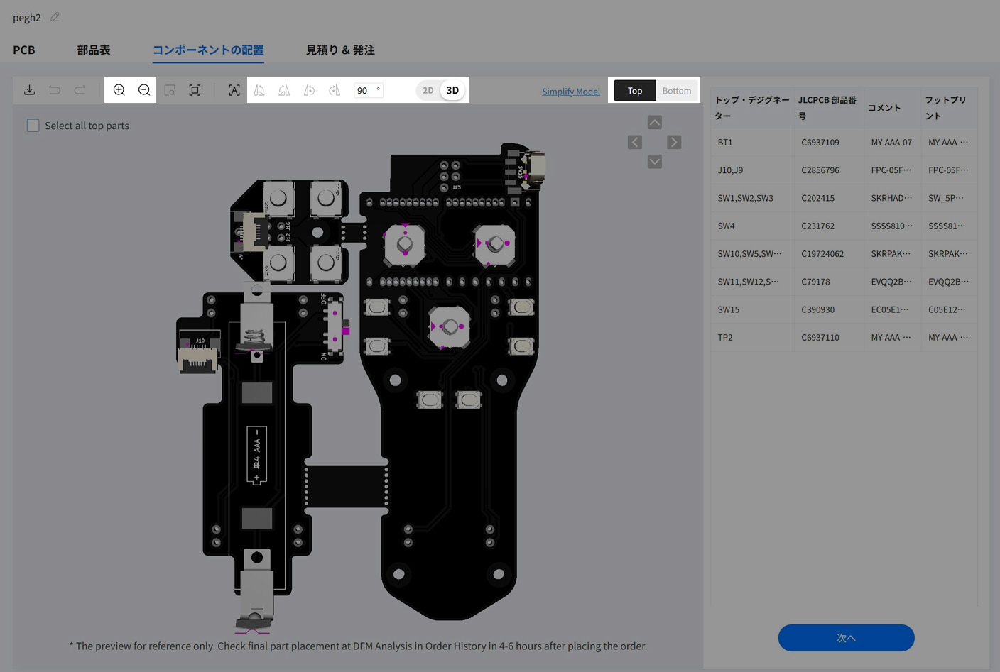

 

いくつかの部品が大きくずれているので  
ツールバーで2Dモードに切り替え部品をクリック＆ドラッグで位置調整をして下さい

Top Botomで表裏を切り替え  
部品を選択した状態で右クリックすると角度調整ができます

 

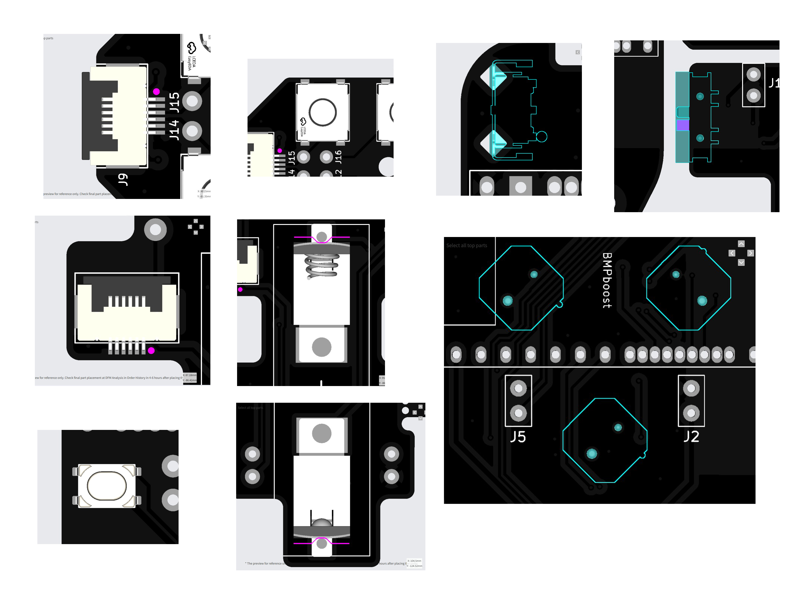

 

各部品はこの位置と角度に調整して下さい  
右3種類の部品は裏に位置合わせ用のピンが付いているので  
裏から確認した方が分かりやすいです

 

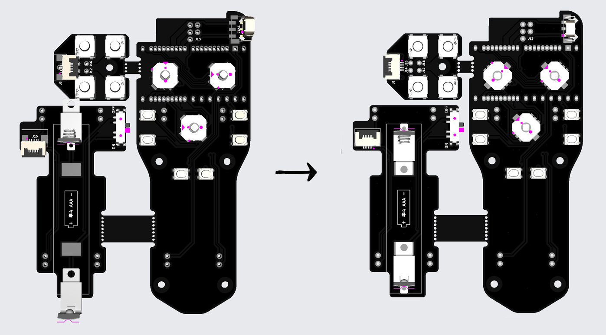

 

終わったら3Dに切り替えグリグリ動かしながら全体を確認します  
問題なければ次へ進んで下さい

 

⑨商品説明を選択してカートへ
-

 

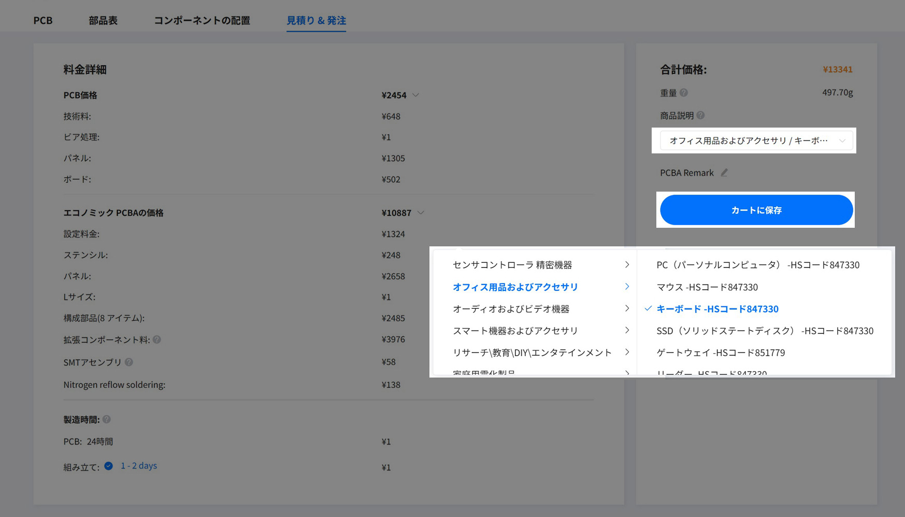

 

スティック型キーボードなので商品説明はこのように選択して下さい

 

⑩チェックアウト
-
 

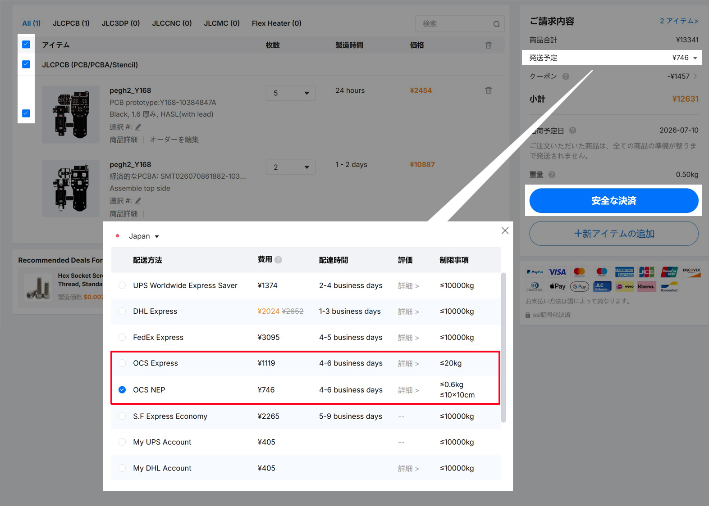

 

発送方法はOCSが安くて早いです  
普通サイズの荷物はOCS Expless､軽量で小さいサイズの荷物はより安価なOCS NEPが選択できます  

 

⑪発注後の部品配置確認と支払い 
-
 

しばらくして発注履歴から部品配置の最終確認ができるようになります  
問題なければ生産を進めるボタンを押して下さい  
問題があればどこを直すかコメントを添えて修正要求をします

 

データの審査が終わると発注履歴のページから支払いが出来るようになります  
**初回登録時のクーポンは割引率が高いので決済時に必ず適用して下さい**

 

#### [戻る](Index.md#目次)

 
 

---

このビルドガイド（文章・画像）は [CC BY 4.0](https://creativecommons.org/licenses/by/4.0/deed.ja) の下に提供されています。

Copyright (c) 2026 nishiiba
