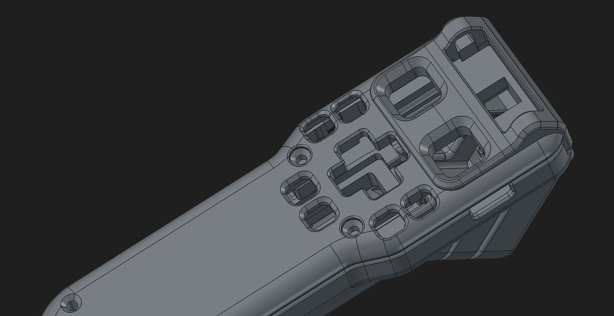
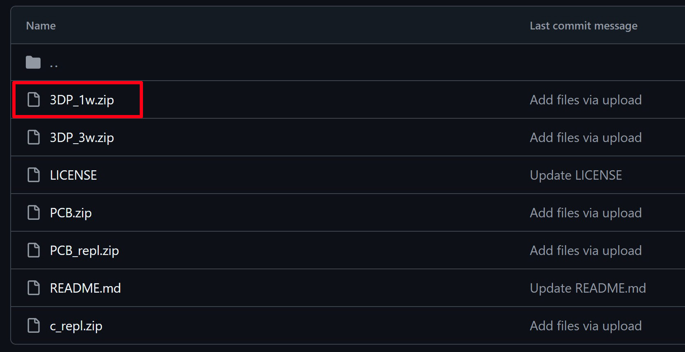
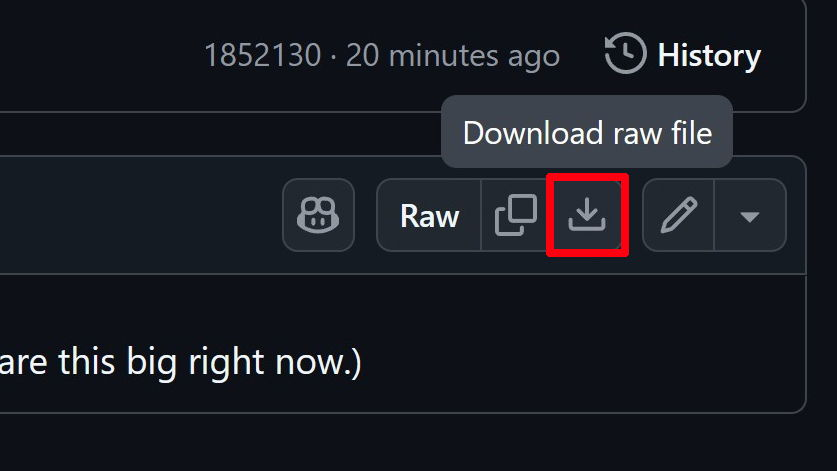
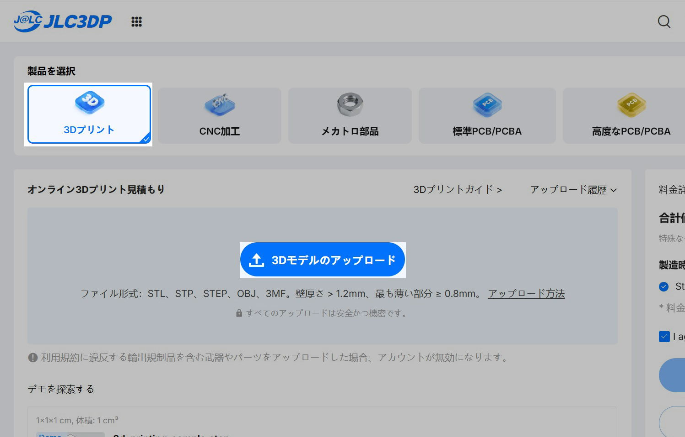
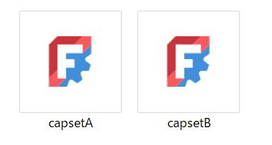
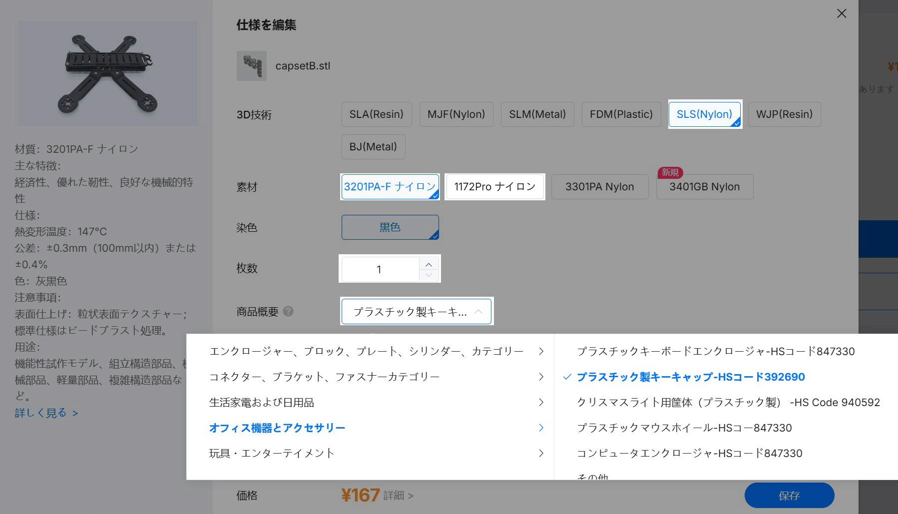
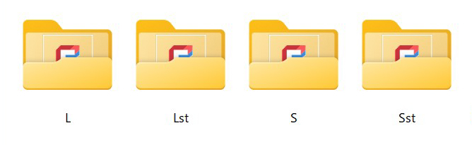
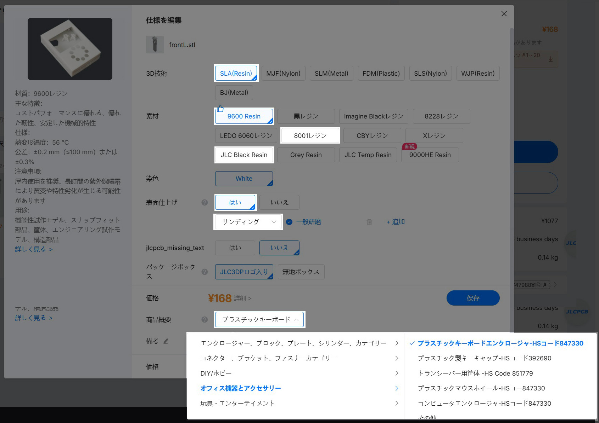
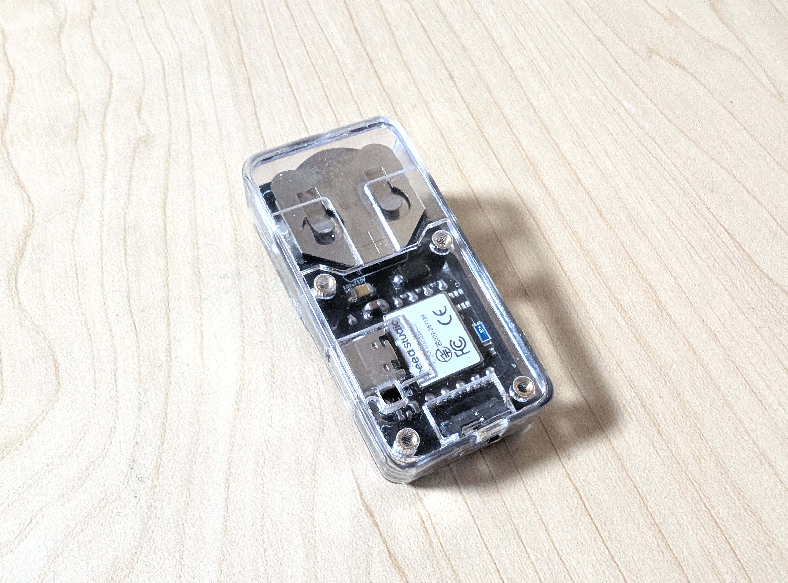
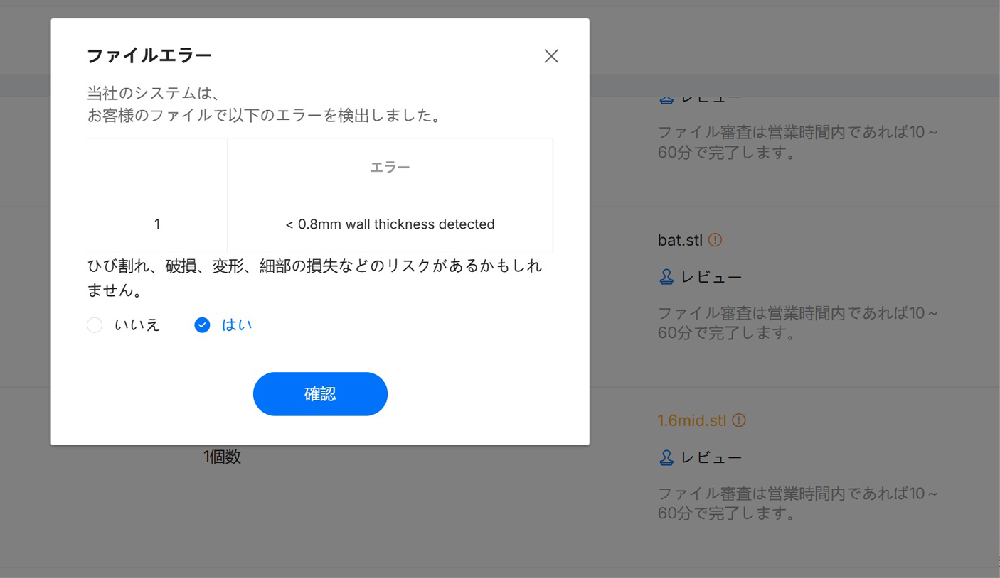

# 3Dプリント部品の発注

 

 

①発注用データのダウンロード
-

 

**[ここからzipファイルをダウンロード ](https://github.com/nishiiba/peghammer/tree/main/PCB_3DP)**  
データの使用はREADMEを読んで自己責任でお願いします  

 

 

 

 

②データのアップロード
-

 

3Dプリント注文ページからSTLファイルをアップロードします

 

 

---
**SLSフォルダ**

スイッチキャップ類はすべてSLS方式で  
素材は以下のどちらかを選んで発注して下さい    

･3201PA-Fナイロン(黒)  
･1172Proナイロン(白)    

 

 

 

商品概要はこのように選択して下さい

 

---
**SLAフォルダ**  

ケース部品は4サイズから1つ選んでSLA方式で発注します  

･Lサイズ  
･Lサイズショートトリガー  
･Sサイズ  
･Sサイズショートトリガー  

 

 

素材は以下の3種類から選んで下さい  

･9600Resin(白)  
･JLC Black Resin(黒)  
･8001(透明)  

8001(透明)は少し割高ですが透明度の高いクリアケースに仕上げてくれます

 

 

**3Dプリントの積層痕を磨くサンディングオプションは必ず選んで下さい**  
**なしを選んでしまうと仕上げをしていない凸凹の状態で届きます**  

 

上記以外の素材でも問題ないかもしれませんが  
テストをしていないので歪みや嵌合はどうなるか分かりません

 

③チェックアウト
-

 

こちらも発送方法はOCSを選択します  

 

④印刷リスクのチェックと支払い
-

 

 

発注後､各部品に印刷リスクの注意が出たら｢はい｣にチェックを入れて下さい  
部品は一通り試作を行っているので問題はないかと思います

 

データの審査が終わると発注履歴のページから支払いが出来るようになります  
**こちらも初回クーポンを必ず適用して下さい**

基板と3DP部品は支払いからだいたい10日くらいで届きます

 

 

#### [戻る](Index.md#目次)

 
 

---

このビルドガイド（文章・画像）は [CC BY 4.0](https://creativecommons.org/licenses/by/4.0/deed.ja) の下に提供されています。

Copyright (c) 2026 nishiiba

