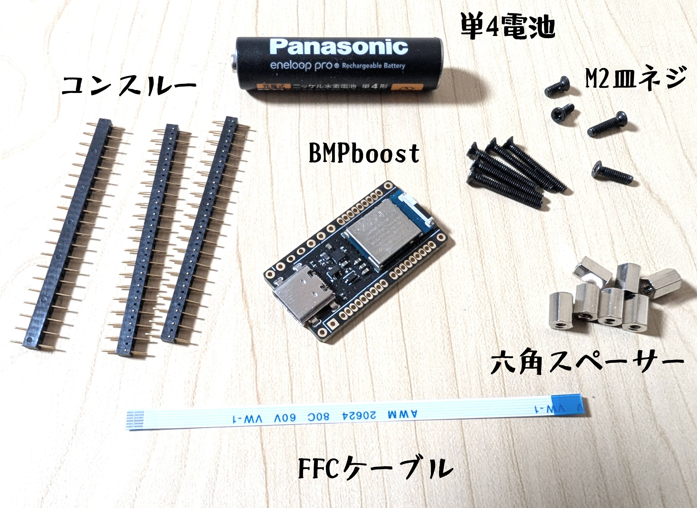

# その他必要部品と費用について

 

 

**■遊舎工房**  
BMP boost(マイコン)　x1  
コンスルー20ピン　高さ2.5mm　x3  
黄銅スペーサー（六角）M2x6mm 10個入り　x1　    ※平径3ではない方です

 

**■amazon**  
Zmbroll 520個 フラットヘッド M2 皿ネジセット  
単4乾電池　x1  
uxcell FFCケーブル 0.5mmピッチ 6ピン 80mm Bタイプ(逆面)　　x1  

**FFCケーブルは必ずBタイプ(逆面)を使用して下さい**  
**Aタイプ(同面)を使用するとショートしてマイコンが壊れる可能性があります**

 

※ショートトリガー版を作成する場合は追加で  
黄銅スペーサー(六角)M2x4mmが1個必要です　

 
 

費用について
-

 

トップページで書いた作製費用約2.3万円の内訳です  
1台分の部品 + スペア基板1枚の価格と考えて下さい  

 

部品取り付け済み基板　2枚　　14,000  
プリント部品1セット(Lサイズ･JLCブラックレジン)　　3,000  
初回クーポン割引　　-3,000  
その他必要部品　　9,200  
(各送料込み)

価格は2026年8月時点のものです

 

 

#### [戻る](Index.md#目次)

 
 

---

このビルドガイド（文章・画像）は [CC BY 4.0](https://creativecommons.org/licenses/by/4.0/deed.ja) の下に提供されています。

Copyright (c) 2026 nishiiba
