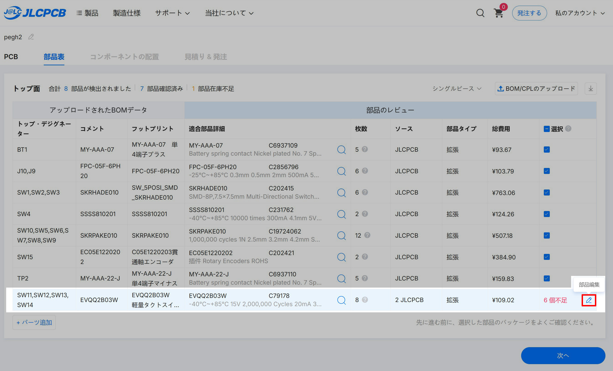
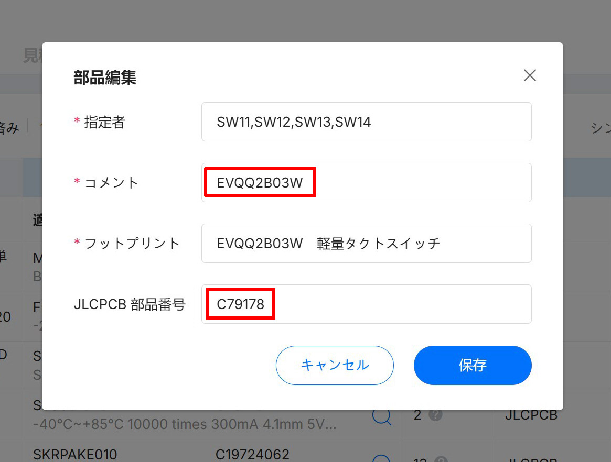
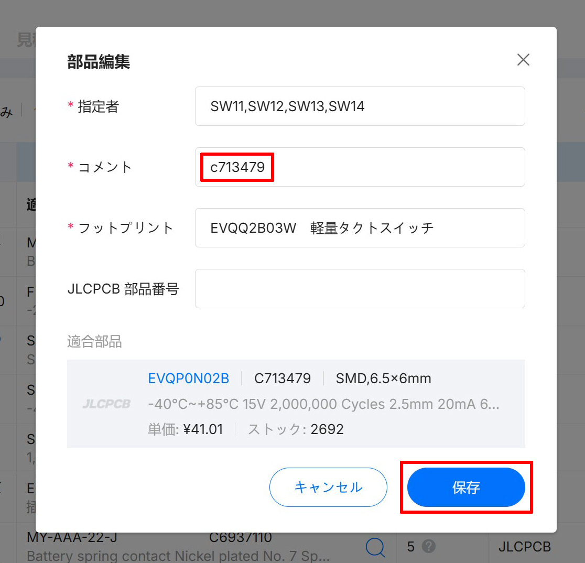
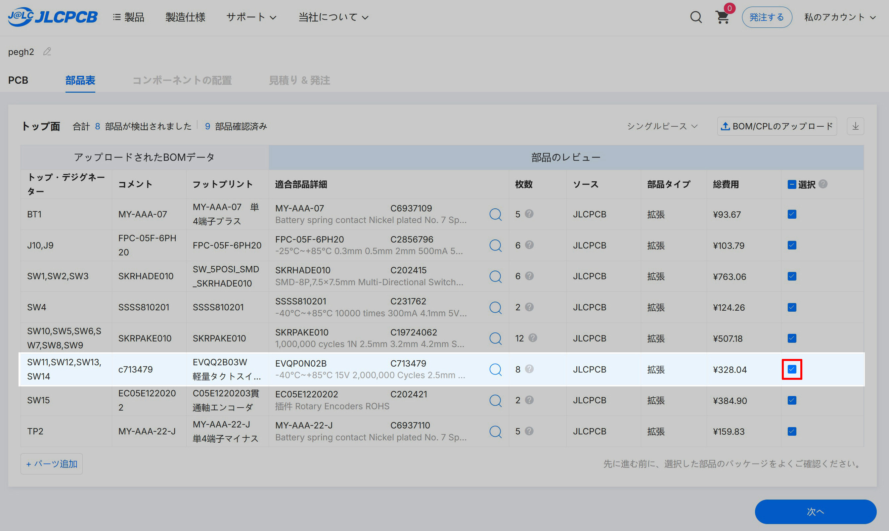
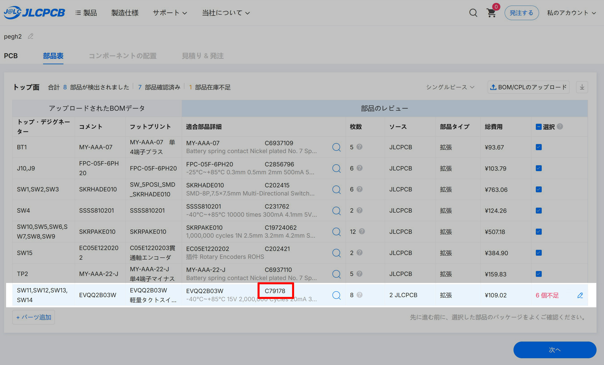
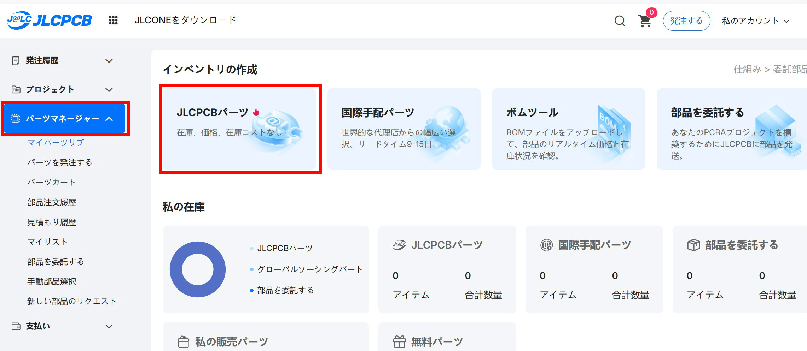
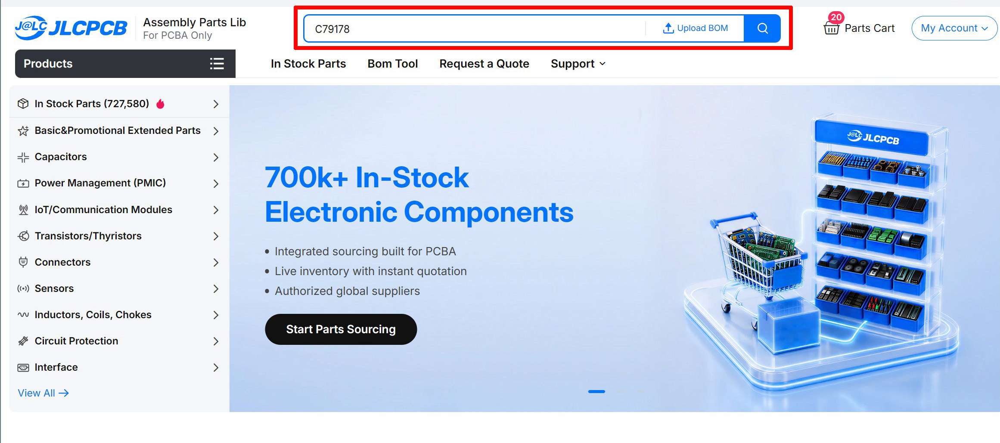
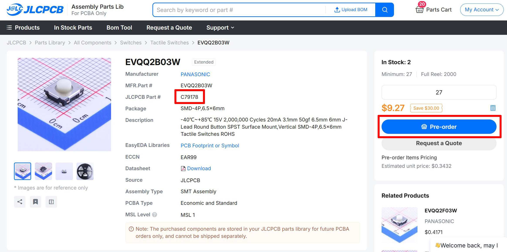

# 部品が在庫切れの場合

 

①代替部品に変更  
②在庫切れ部品の予約注文  
③基板発注をPCBWAYに変更する  
④在庫切れ部品を自分で調達する

以上4つの方法があります

 

## ①代替部品に変更する
 

**代替部品に変更可能なのは以下の2箇所のみです**  

 

トリガー用スイッチ　C79178(標準部品) → C713479(代替部品)  
5方向スイッチ　C202415(標準部品) → C209766(代替部品)

 

トリガー用スイッチに代替部品を使う場合は  
スイッチキャップも変更が必要になります  
**[ここからc_repl.zipをダウンロード](https://github.com/nishiiba/peghammer/tree/main/PCB_3DP)**

 
 

欠品している部品は右端の部品編集から変更を行います  

 

以下の2箇所を消し

 

代替部品の番号を記入して保存を押します

 

チェックを入れて変更完了です

 
 

## ②在庫切れ部品の予約注文  

 

在庫切れ部品を予約購入して自分用にストックしておき  
PCBAを発注する際はそこから使用する方法です

 

在庫切れ部品の管理番号(Cから始まる番号)をコピーして  

 

アカウントページ左側のParts ManagerからJLCPCB Partsに移動 

 

上の検索バーに部品の管理番号を貼り付けて検索をしてください 

 

在庫切れ部品のページがヒットするのでそこから予約注文を行います  

 

取り寄せまで時間がかかる事と  
部品によっては最低購入数が多めに設定されていて  
費用がかさんでしまうことがネックです

 
 

## ③基板発注をPCBWAYに変更する  

 

JLCPCBは自社(LCSC)のパーツ在庫を使用するのに対し  
PCBWAYはDigiKeyやMouserなど複数の国際的な卸業者から  
部品を取り寄せているので在庫が安定しているようです

私はこちらを利用したことがないため変更する際は  
｢PCBWAY PCBA 発注方法｣ で調べてみて下さい

 
 

## ④在庫切れ部品を自分で調達する

 

在庫切れ部品は除外して発注を進め  
部品は自分で調達､取り付けを行う方法です

専用の道具が必要になり取り付けも簡単ではないので  
電子工作に慣れた人以外はおすすめしません

 
 

#### [戻る](order_1.md#部品リストの確認)

 
 

---

このビルドガイド（文章・画像）は [CC BY 4.0](https://creativecommons.org/licenses/by/4.0/deed.ja) の下に提供されています。

Copyright (c) 2026 nishiiba

