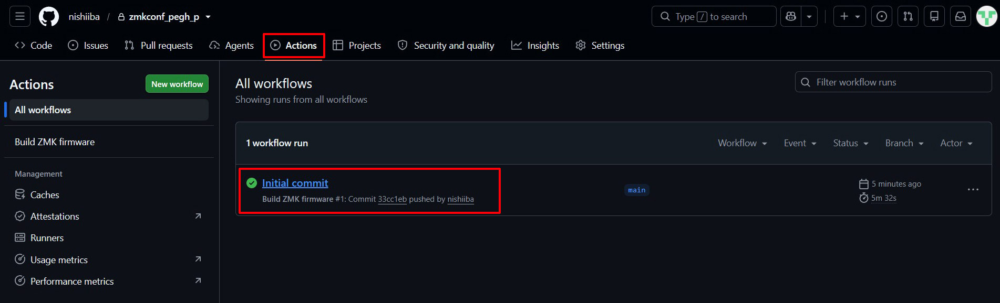
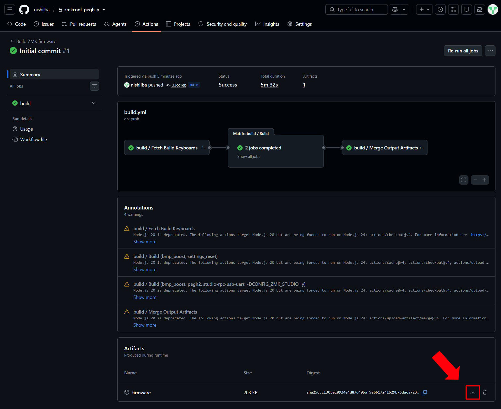
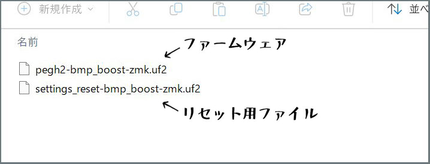

# ファームウェアの書き込みとペアリング
 

**[ここからファームウェアをダウンロード ](https://github.com/nishiiba/zmkconf_pegh_p/)**  
データの使用はLICENSEを読んで自己責任でお願いします 

 

 

上のタブからActionsに移動して一番新しいUpdateをダウンロードして下さい

 

 
 

## ファームウェアの書き込み

 

 

zipにはファームウェアとリセット用ファイルの2つが入っています　

デバイスの電源をオフにしてPCとUSB接続をするとフォルダが表示されるので  
そこにファームウェアをドラッグ&ドロップして下さい  
書き込みが完了するとフォルダが一瞬消えてデバイスが使える状態になります

 
 

## Bluetooth接続

 

 

電源を入れるとPC側にBluetooth機器として認識されるのでペアリングを行います  
うまく接続ができない場合は[トラブルシューティング](ts.md)を確認して下さい

 
 

## スリープモードについて

電源ONのまま放置していると60分後にスリープモードに入ります(初期設定)  
スリープモードは省電力なのでずっとONのままでもかなり電池が持ちます  
ボタンを操作すると2～5秒で復帰しますがうまく復帰しない場合は電源を入れ直して下さい  

**長期間使用しない場合は乾電池を取り外して下さい**

 

 
 

#### [戻る](Index.md#目次)

 
 

---

このビルドガイド（文章・画像）は [CC BY 4.0](https://creativecommons.org/licenses/by/4.0/deed.ja) の下に提供されています。

Copyright (c) 2026 nishiiba
