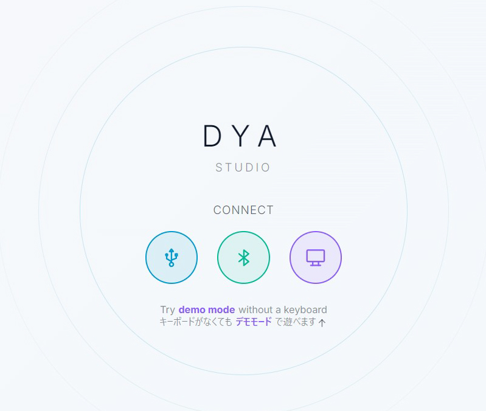
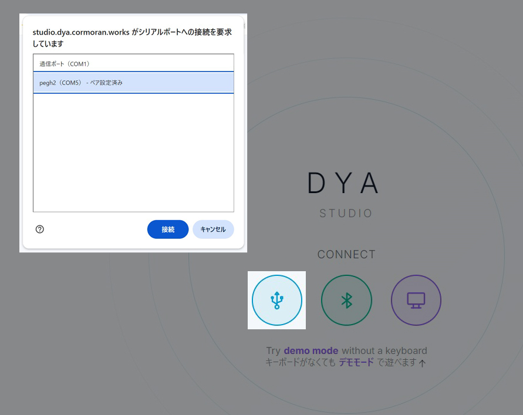
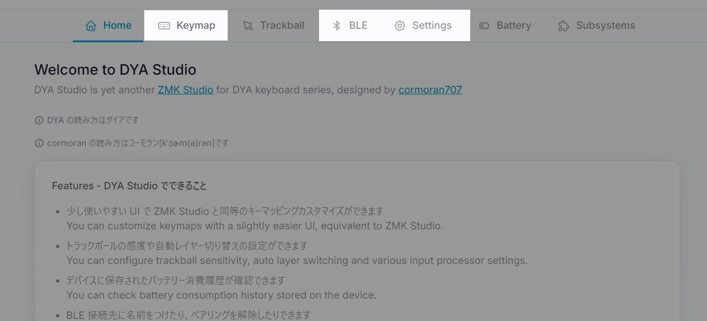
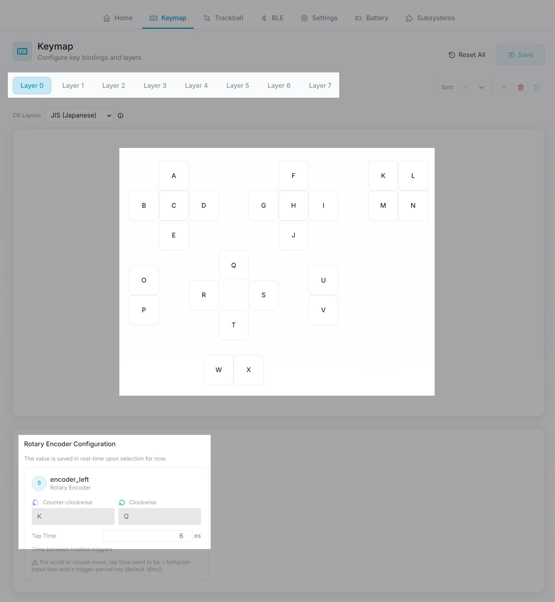
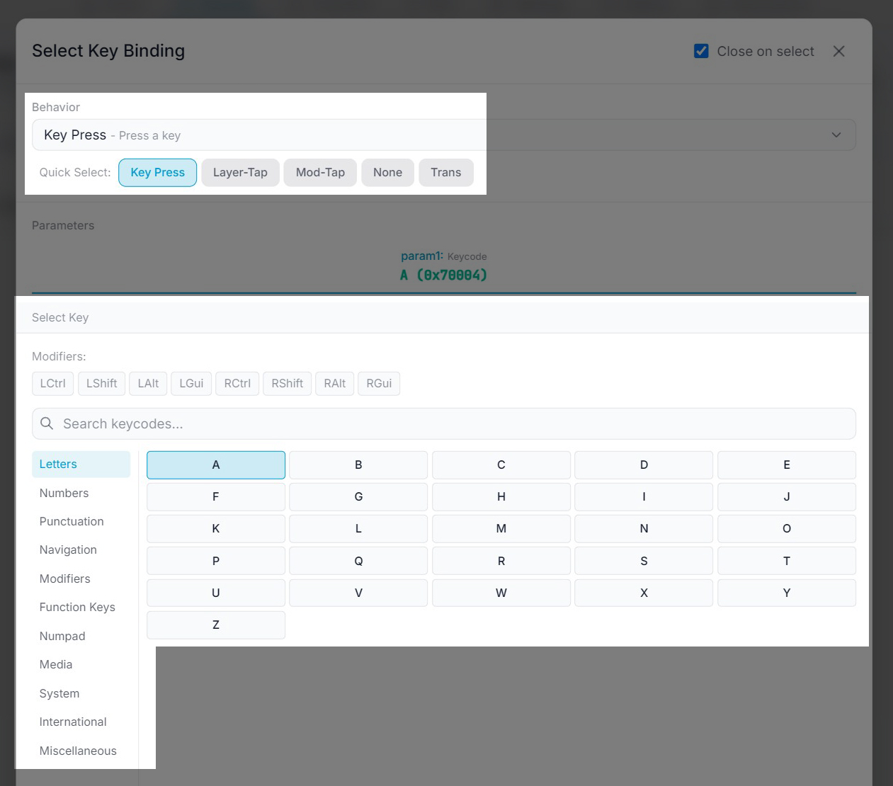
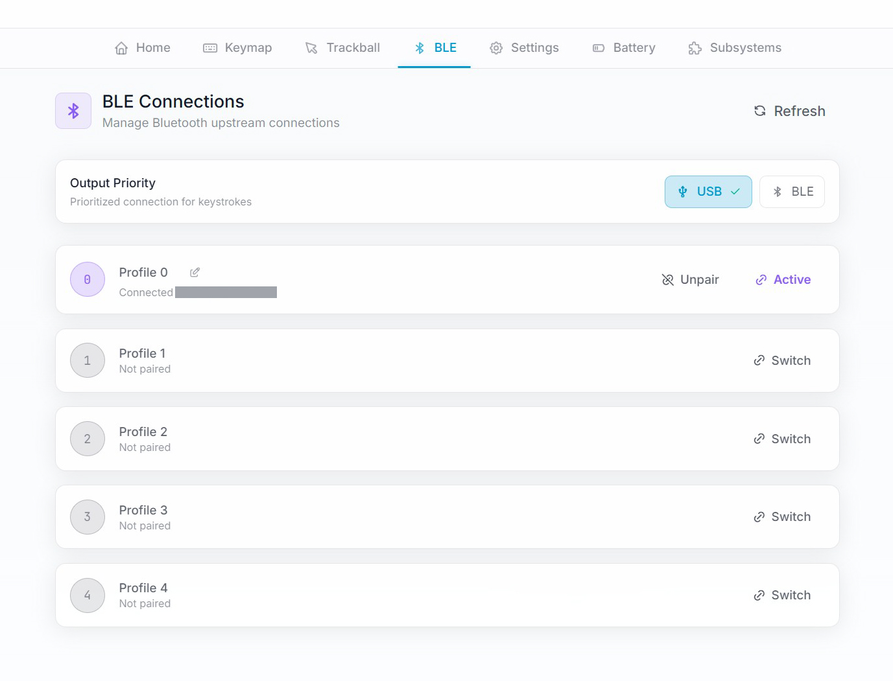

# DYA Studioを使用したボタン設定
 

 

ボタン設定変更はcormoran氏が作成したwebアプリ  
[DYA Studio](https://studio.dya.cormoran.works/)が便利です

 

 

デバイスの電源を入れてPCとUSB接続します  
うまく接続できない場合はUSBケーブルを繋ぎ直してブラウザを再起動して下さい  
bluetooth接続も可能ですがUSBの方が読み込みが速いです

 

 

接続が成功すると画面が変わるので上の3つで設定を行います

 

## キーマップ設定

 

上から レイヤー､各ボタン､ホイール の設定ができます

※ここで出てくるレイヤーとはキー配列レイヤーのことです  

 

## キー設定(ビヘイビア)

キー設定は｢ビヘイビア + パラメータ｣の組合せで行います  
例:｢キーを押す + Zキー｣や｢レイヤーを切り替える + レイヤー3｣など  

   

ここではペイントソフトでよく使いそうなビヘイビアのみを紹介しています  

 

---
**デフォルトのビヘイビア**

Key Pless(&kp)　　　　　　　キー入力　CtrlやAltなどとの組み合わせも可能  
Layer Tap(&lt)　　　　　　　短押しでキー入力　長押しをしている間はレイヤー切り替え  
Mouse Key Pless(&mkp)　　マウスボタン入力  
Mouse Scroll(&msc)　　　　マウスホイールのスクロール  
Toggle Layer(&tog)　　　　指定したレイヤーに移動　手動で戻すまで固定  
None(&none)　　　　　　　何もしない  

  

**追加ビヘイビア**

TAP_HOLD200　　　　　短押しでキー入力　長押し0.2秒で別のキー入力  
TAP_HOLD300　　　　　短押しでキー入力　長押し0.3秒で別のキー入力  
HOLD200　　　　　　　長押し0.2秒でキー入力  
HOLD300　　　　　　　長押し0.3秒でキー入力  
TAP_TOGLAYER1500　　　短押しでキー入力　長押し1.5秒でToggle Layerビヘイビア実行  
TAP_TOGLAYER3000　　　短押しでキー入力　長押し　3秒でToggle Layerビヘイビア実行  
TAP_BT1500　　　　　　短押しでキー入力　長押し1.5秒でBluetoothビヘイビア実行  
TAP_BT3000　　　　　　短押しでキー入力　長押し　3秒でBluetoothビヘイビア実行  

  

ホイールについてはDYA Studioで設定してもうまく動作しないビヘイビアがあるようです

---

 

Toggle LayerまたはTAP_TOGLAYERを使ってレイヤー0　←→　レイヤー3　と切り替えたい場合  
どちらのレイヤーにもToggle Layer(レイヤー3)キーを設定して下さい  
電源をオフにするとリセットされレイヤー0に戻ります  
 

 

設定変更が終わったら右上のSaveを押してキーマップを保存して下さい

 
  

## 複数機器との接続

BLEの項目から最大5つの機器との接続切替が可能です

 

## TAP_BTビヘイビアでの接続先切り替え

 

TAP_BTビヘイビアを使用しても接続先切り替えができます

 

ボタンのどれかにTAP_BTビヘイビア､パラメータにNext Profileを設定して下さい  
このボタンを長押しするたびにプロファイル(接続先)が　0→1→2→3→4→0　と切り替わります  

電源をオフにするとリセットされ接続先は0に戻ります

 
 

## 注意

**キー設定の保存**  
DYA Studioにはキー設定をエクスポートする機能がありません  
設定が決まったらスクリーンショットを取っておくことをおすすめします  
 
**5方向スイッチの中央長押しによる誤爆**
 
5方向スイッチは少しでも傾けると入力されてしまう構造で  
中央押し込みボタンの長押しをすると周りの方向ボタンまで押してしまうことがあります  
まっすぐ押せるように慣れるか､誤爆しても支障のないキー配列で対処して下さい  

 
 

#### [戻る](Index.md#目次)

 
 

---

このビルドガイド（文章・画像）は [CC BY 4.0](https://creativecommons.org/licenses/by/4.0/deed.ja) の下に提供されています。

Copyright (c) 2026 nishiiba
