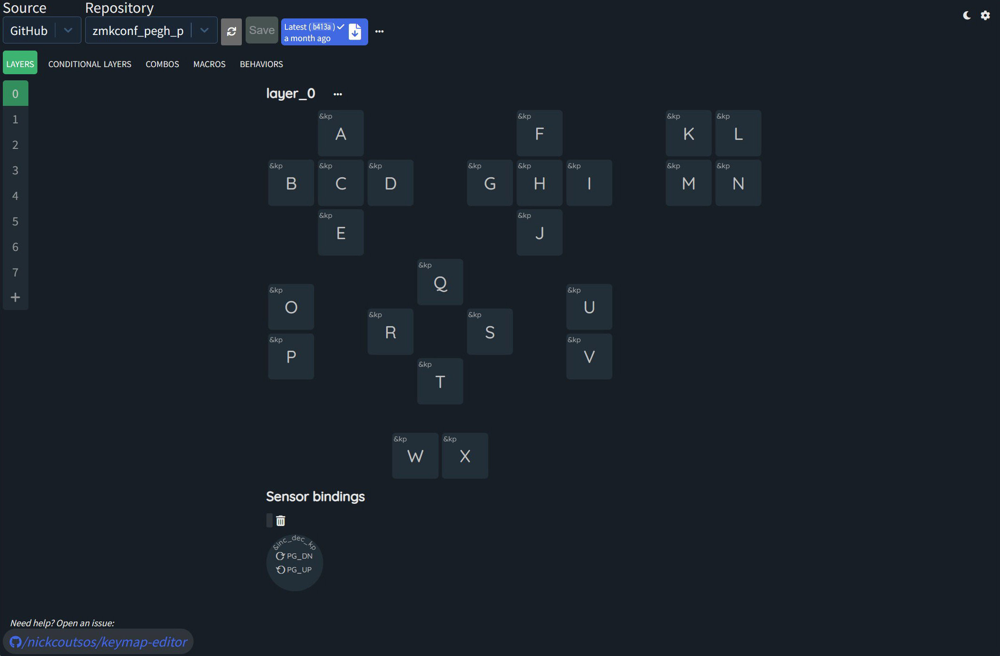
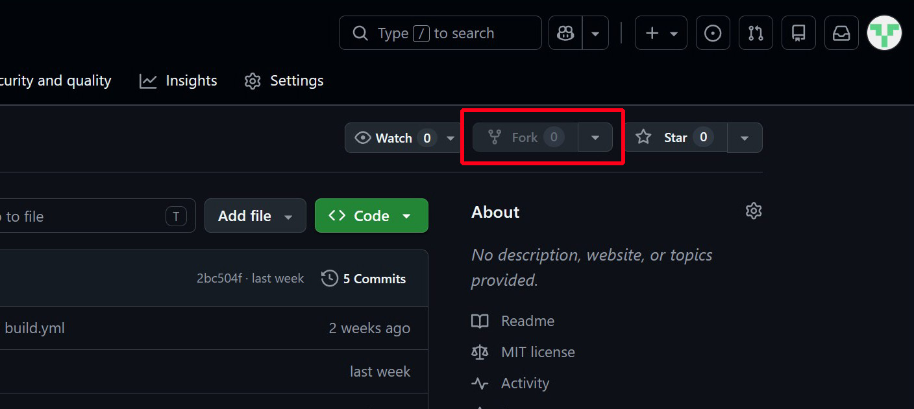
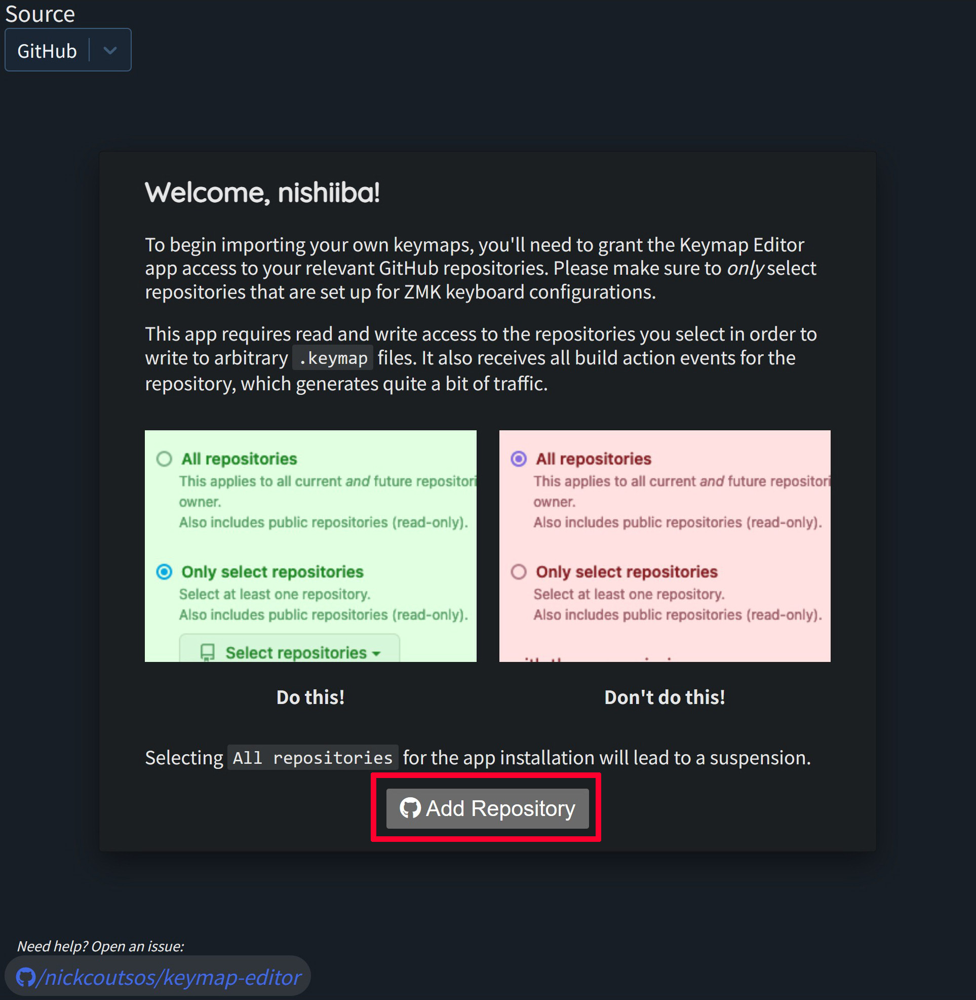
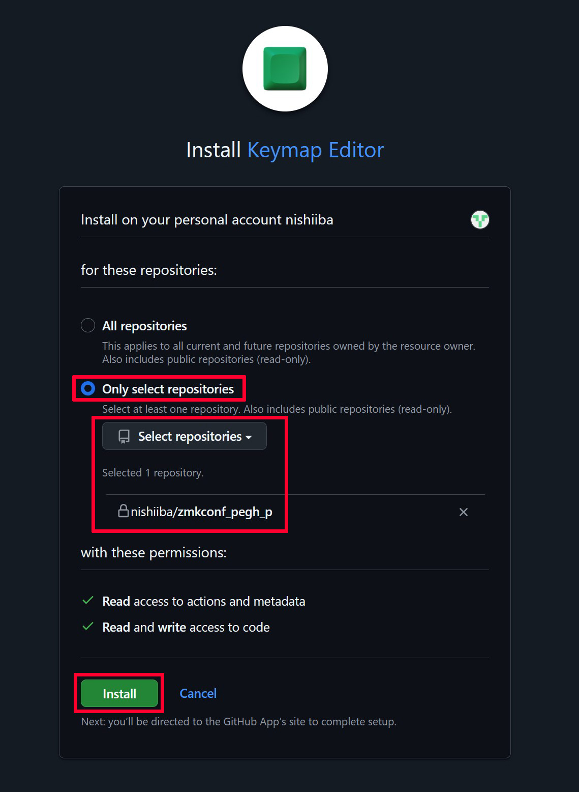
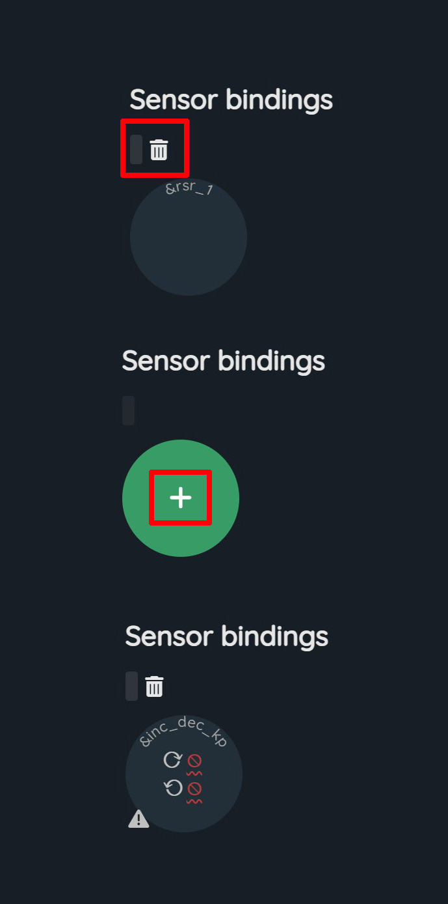
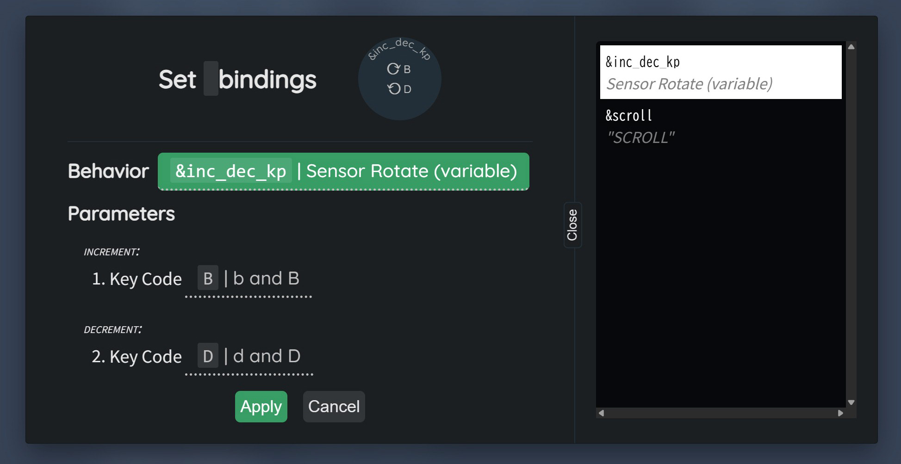
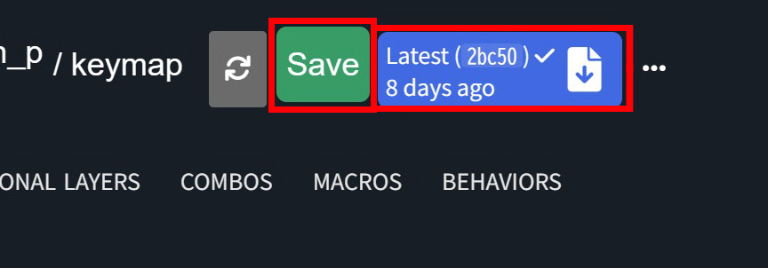
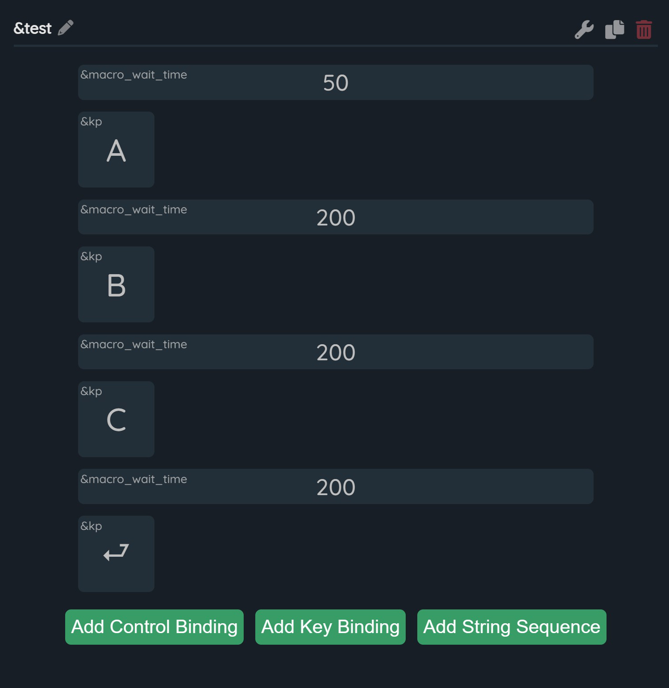
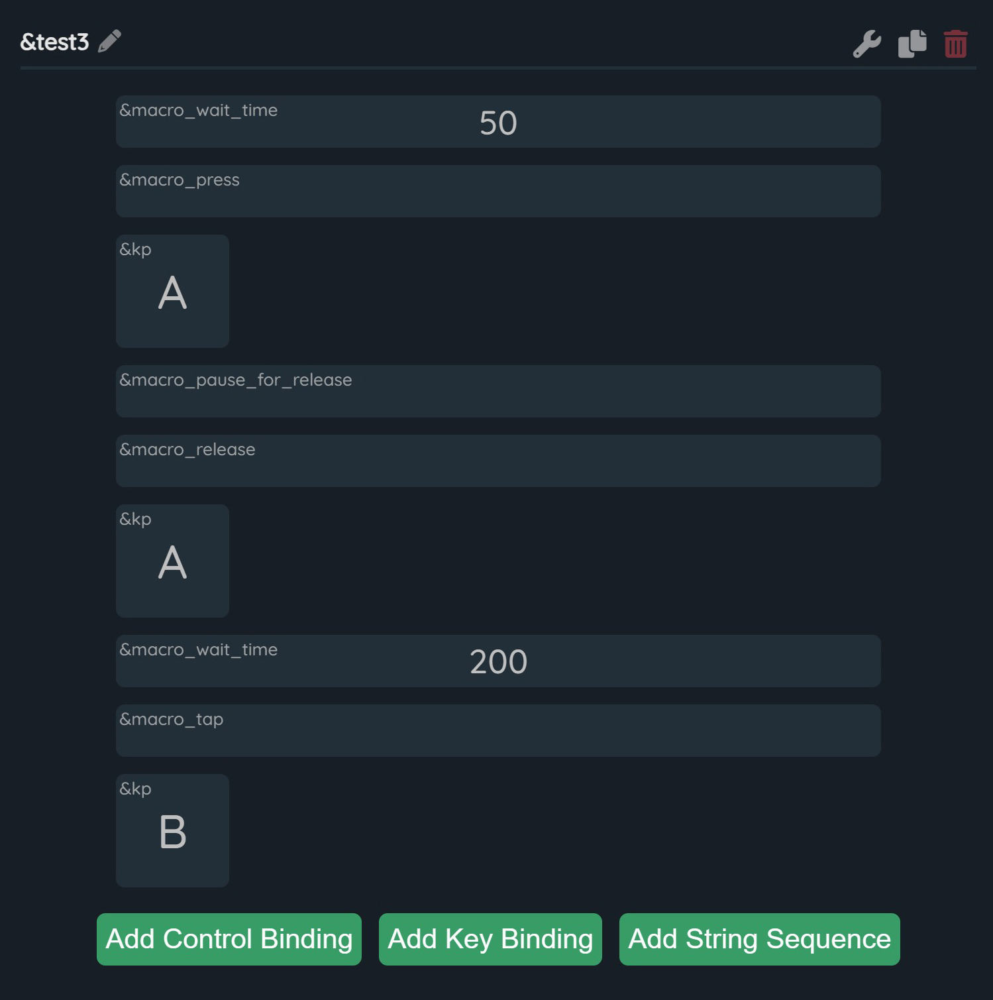

# keymap-editorを使用したボタン設定

 

 

## keymap-editorでできること

･ホイールの設定変更  
･ビヘイビアやコンボキー､マクロの新規作成  
･キーの押下時間など細かい設定変更  
･saveするごとに履歴が残るので過去のキーマップに戻すことが可能

 

キー設定で解説した追加ビヘイビアもkeymap-editorで作成しています  
DYA Studioでうまく動作しないホイールのビヘイビアはこちらで設定可能です

 

DYA Studioよりも細かい設定ができますが導入に手間がかかる事と  
設定変更するたびファームウェアを生成して書き込む必要があるので  
少しハードルが高いです  

  

## 準備

①Githubのアカウントを作成  
-
 

[Github](https://github.com/)にアクセスして自分のアカウントを作成します  

 

②リポジトリをフォーク  
-
 

リポジトリ　=　共有フォルダ   
フォーク　=　他人の共有フォルダを丸ごと自分のアカウントにコピーして編集可能にする  

 

ファームウェアの元データが格納してある[zmkconf_pegh_p](https://github.com/nishiiba/zmkconf_pegh_p)リポジトリをフォークして下さい  

名前はそのままで右下のCreate forkボタンを押します

  

③keymap-editorのインストール
-

 

[keymap-editor](https://nickcoutsos.github.io/keymap-editor/)にアクセスしGithubアカウントでログインしてから  
zmkconf_pegh_pリポジトリを指定してinstallを押します  

※keymap-editorはgithubアカウントにインストールされます

 

 

 

これでkeymap-editorが使用できるようになりました

 
 

## キーマップ変更
 

基本操作はDYA Studioとだいたい同じです

ホイールを編集する場合は&rsr_1ビヘイビアを一旦削除して  
&inc_dec_kp(キー入力)　または　&scroll(マウスホイール)　を割り当てて下さい

**&rsr_1ビヘイビアを削除すると今後DYA Studioではホイールの設定ができなくなります**

 

 

変更が完了したら左上のSaveを押してから右の青いボタンを押しActionsに移動します

 

 

フォークしたリポジトリのActionsにファームウェア(zipファイル)が生成されるので  
ダウンロードしてデバイスに書き込みます　　

 

 

ファームウェアの生成は2分程かかり有線接続で書き込まなければならないため  
まずDYA Studioでボタン設定を試して配列が固まったらkeymap-editorを  
使用するのが良いかと思います  

DYA Studioはデバイス内の設定を変更するもの  
keymap-editorはクラウド上でファームウェアを作り変えるものと考えて下さい

 
 

## マクロの作成

 

ペイントアプリでよく使用するマクロの一例です  
マクロは上のMACROSのタブから作成することが出来ます  

 

### キーを順番に入力 

このようにキー入力とウェイトを交互に入れて下さい  
適度にウェイトを入れないと入力が速すぎてPCやアプリによっては取りこぼしがあります  

 
 

### 押した時と離した時に別々のキーを入力

 

Aを押す動作とAを離す動作を入れてからBのタップを入れます

 

作成したマクロはビヘイビアとして登録されDYA Studioでも使用可能になります  

 
 

#### [戻る](Index.md#目次)

 
 

---

このビルドガイド（文章・画像）は [CC BY 4.0](https://creativecommons.org/licenses/by/4.0/deed.ja) の下に提供されています。

Copyright (c) 2026 nishiiba
