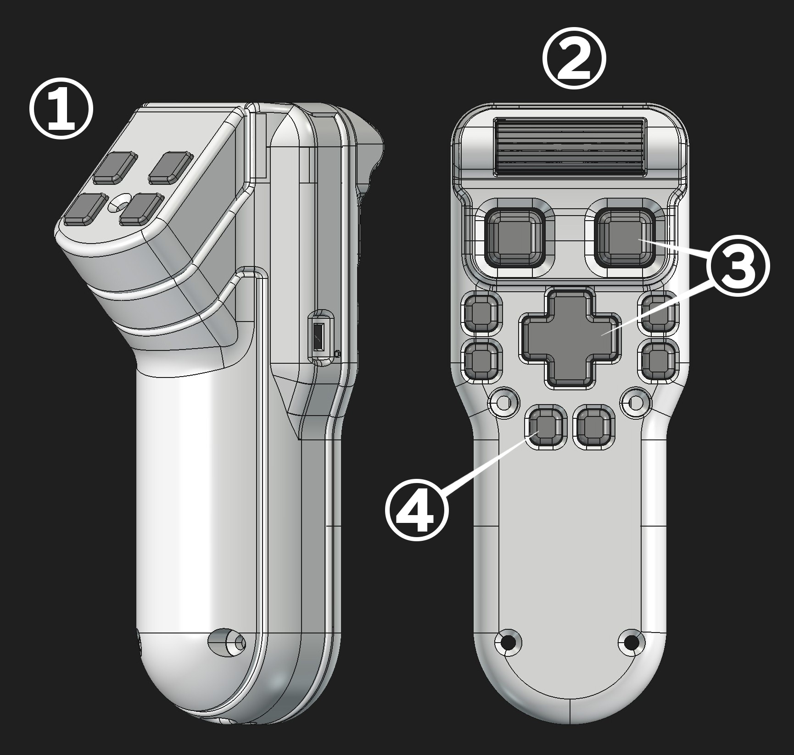

# スイッチの操作感と静音化
 

 

①トリガースイッチ
-
パナソニック製　EVQQ2B03W  
動作寿命200万回､押下圧0.5N

---
重さはジョイコンのプッシュボタンの半分くらい  
マウスのようなクリック音がします

 
 

②ホイール
-
アルプスアルパイン製　EC05E1220202  
動作寿命10万サイクル

---
クリック感のあるホイールで回すとカリカリ音がします

 
 

③5方向スイッチ 
-
アルプスアルパイン製　SKRHADE010  
動作寿命100万回　上下左右は動作圧1.2N　中央ボタンは押下圧2.35N  
**※アナログジョイスティックではありません**

---
上下左右の操作は軽めで中央押し込みは少し重め  
操作感はガラケーの十字キーやデジカメの操作ボタンに似ています  

 

上下左右は静か､中央押し込みはマウスのようなクリック音がします

 
 

④プッシュスイッチ  
-
アルプスアルパイン製　SKRPAKE010  
動作寿命100万回　押下圧1.0N

---
重さはジョイコンのプッシュボタンと同じくらい  
トリガースイッチより静かなクリック音がします

  

静音化について
-
基板工場では巨大なオーブンを使って一気に部品のはんだ付けが行われるのですが  
この時スイッチ全体が加熱されるためかクリック音がだいぶ静かになります
  

 

実際にいくつか試作した基板では全てのスイッチが静音化されていました  
ただし必ずそうなるとは言い切れないので静かになっていたらラッキーくらいに考えて下さい

 

※手はんだで取り付けた場合は静音化しません

 
 

#### [戻る](Index.md#目次)

 
 

---

このビルドガイド（文章・画像）は [CC BY 4.0](https://creativecommons.org/licenses/by/4.0/deed.ja) の下に提供されています。

Copyright (c) 2026 nishiiba

